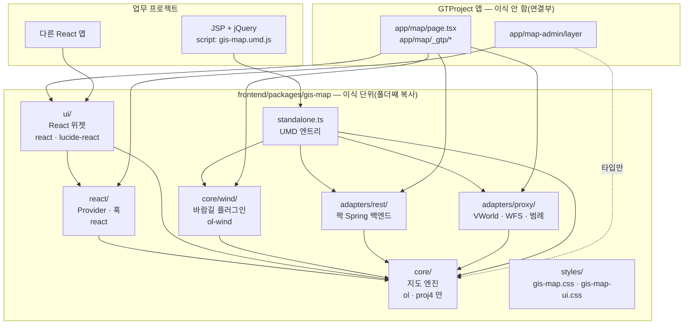
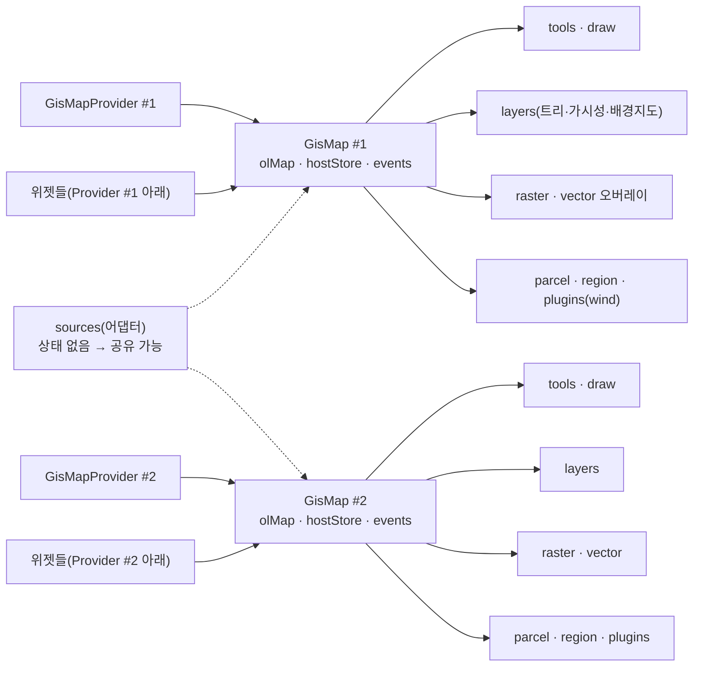
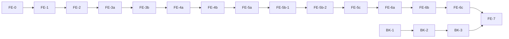

# 지도 모듈 전면 재개편 (map-module-restructure)

- 작성: 2026-09-23 / planner
- 구현 담당: map-dev (프론트 지도 모듈 + 지도 백엔드 도메인 전부)
- 상태: **확정** (2026-09-23 사용자 결정 반영 — 끝의 "결정 사항"·"변경 이력" 참고)
- 구현 완료: 2026-10-02 (FE-7까지. 커밋은 사용자 요청 시 — 아래 요약)

## 구현 완료 상태 요약 (2026-10-02, FE-7)

> 아래 본문은 2026-09-23 설계 원문이다. 구현하면서 바뀐 곳은 본문에 **(변경: …)**, 구현으로 확정된 곳은 **(확정: …)**,
> 없어진 옛 구조는 **(삭제됨)**으로 표시했다. 호출별 상세는 저장소 밖 작업 기록(`_workspace/map-module-restructure/`, gitignore)에 있다.

| 호출 | 상태 | 근거 |
|---|---|---|
| FE-0 면적 버그 | 완료 | QA 통과, 메인 S6(면적 399,106 m² 이후 단계마다 동일) |
| FE-1 패키지 골격 | 완료 | QA 통과, 메인 S1 |
| FE-2 엔진 기반·React 바인딩 | 완료 | QA 통과, 메인 기준선 6개·레이어 22단계 diff 0 |
| FE-3a / FE-3b 도구 | 완료 | QA 통과, 메인 S5·S6·S7(반경 지상 거리 오차 0 m) |
| FE-4a / FE-4b 레이어·오버레이·어댑터 | 완료 | QA 통과, 메인 S1~S4·S7~S9·S11~S13, 요청 수 TIFF 2·나만의지도 2 |
| FE-5a / FE-5b-1 / FE-5b-2 / FE-5c(+후속) UI 이동·스타일·조립 | 완료 | QA 통과, 메인 기준선 diff 0(5b-1에서 로고 lucide 교체로 기준선 갱신) |
| FE-6a 이중 지도 | 완료 | QA 통과, 메인 `/map-dev/dual` 확인. **검증 페이지는 사용자 최종 확인 전이라 남겨 둠** |
| FE-6b UMD (a) / FE-6c attach (b) + 호환 매트릭스 | 완료 | QA 통과(7.1.0~10.10.0 공식 full build 전부 통과), 메인 `/map` 회귀 diff 0 |
| FE-7 문서·규칙·감사 확정 | 완료(메인 확인 대기) | 감사 최종판 통과, tsc 0, `build:gis-umd` 두 모드 산출물 md5 = FE-6c. `CLAUDE.md`·`.claude/rules`·`agents`·`SKILL.md`는 제안본만 만들고 사용자 승인 후 반영 |
| BK-1 User FK 제거 | 완료 | QA 통과, compile. 이관 SQL(B1)은 **사용자 실행 대기** |
| BK-2 인증·에러 경계(B2a) | 완료 | QA 통과, 메인 curl 상당 확인(HTTP 상태·메시지 동일) |
| BK-3 DDL·쿼리 명세 문서 | 완료(문서) | `references/` 4개. SQL 캡처·DB 실측은 운영 DB라 하지 않음(문서에 "추론·미실측" 표시) |

**설계와 달라진 결정(구현 기준)**

| # | 설계 원문 | 구현 | 호출 |
|---|---|---|---|
| 1 | attach 빌드: `ol/*`마다 external + Rollup globals | 가상 모듈 + **external `ol` 하나**(`olPath`/`olMember` 런타임). 원안은 로드 순간 경로 29개를 읽어 하나라도 없으면 checkOl 전에 죽음 | FE-6c |
| 2 | (a) `gis-map.css` = ol.css + 코어 CSS | ol.css 선택자를 전부 **`.gm-root` 안으로 한정**(호스트의 다른 OL 지도 보호) → (a) 지도 요소에 `gm-root` **필수** | FE-6c |
| 3 | `gis-map.attach.css` = gis-map.css | 코어 CSS를 엔진 DOM 뿌리 3종(`.gm-measure-tooltip`·`.gm-text-input`·`.gm-tool-hint`)으로 옮기고 `.ol-*` 규칙 제거 | FE-6c |
| 4 | `OlCompatReport { version, missing, testedRange }`, REQUIRED 초안 | `ok`·`minVersion`·`belowMinimum` 추가. REQUIRED **51개**(View·geom.Circle·proj.getPointResolution 빠짐, `geom.Polygon.fromCircle`·`circular` 추가). `MIN_OL_VERSION 7.1.0`, `TESTED_OL_MAX 10.10` | FE-3a·3b·6c |
| 5 | 6.15는 "시도·비보장" | 6.x·7.0 **차단 유지(7.1+)**. 공식 6.15.1·7.0.0 full build(GitHub 릴리스)도 버전 검사만 건너뛰면 엔진 변경 없이 전 항목 통과 — 최소 버전 하향은 사용자 결정 대기 | FE-6c·QA |
| 6 | 호환 매트릭스 `examples/attach-matrix.html`(CDN) | Node + CDP 러너(저장소 밖) + 공식 npm 고정 버전. 패키지엔 `examples/jsp/attach.html`로 수동 확인 | FE-6c |
| 7 | `attachGisMap` 검사: ol 사본·중복 부착 | + 뷰 좌표계 ↔ EPSG:4326 변환이 없으면 명확한 오류, `registerProjections`는 변환만 더하기(객체 유지) | FE-6c |
| 8 | 기본 중심 `[127.289, 36.48]`(세종) | 코어 기본은 **중립 `[127.5, 36.5]`**. 세종은 GTProject가 config로 넘김 | FE-2(메인 결정) |
| 9 | 펼침 상태: /map도 `usePersistentExpanded` | /map은 코어 `LayerTreeState.expanded` + 주입 `config.layers.expandedStorage`(`browserExpandedStorage("layer-group-expanded")`), /map-admin만 `usePersistentExpanded`. 같은 키·형식 | FE-4a |
| 10 | 오버레이 컨트롤러 메서드 | `openCatalog()`(GeoTIFF·나만의지도 목록 + PROCESSING 폴링을 코어에, destroy가 폴링까지 해제), `getOlLayer` 추가 | FE-4b |
| 11 | 반경 도구 좌표계 언급 없음 | 측지 원 폴리곤(`Polygon.circular`, 128각) — 뷰 좌표계 무관, 옛 반경 크기 버그(약 1.245배) 해결 | FE-3b |
| 12 | `MapShellProps` 7개 | + `className`·`onPanelChange`·`showSearch`·`showBasemapSwitcher`·`showUser`·`showNavRail`·`showRegionBadge`·`showMobileLayerButton`·`showWindLegend`·`children`, `MapRoot`·`primaryThemeVars`·`DEFAULT_MAP_BRAND`·`DEFAULT_STATUS_BAR_PROJECTION` | FE-5c |
| 13 | page.tsx 인라인 config·로고 `MapIcon` | `app/map/_gtp/gtpMap.tsx` 모듈 상수(참조 안정), 로고 lucide `Earth` | FE-5c |
| 14 | (없음) | **앱 기억 `app/map/_gtp/mapSession.ts`**: 같은 탭 페이지 이동에서 열린 패널·그리기 스타일·켠 도구·반경을 이어 줌(메모리, 새로고침하면 처음부터 = 옛 zustand와 같은 수명). 주인(userId)이 바뀌면 지움, 바람길은 기억하지 않음 | FE-5c·후속 |
| 15 | CSS 변수 `--gm-text`·`--gm-muted`·`--gm-border` 등 | 실제 화면색과 달라 만들지 않음. 브랜드 4개(`--gm-primary`·`-rgb`·`-hover`·`-deep`) + 크기·글꼴 토큰 | FE-5c |
| 16 | UMD (a) 전역 `{ create, plugins, adapters, version }` | + `createGisMap` 별칭, `controls.scaleLine`(번들 ol 사본으로 축척 막대). (b)는 + `attachGisMap` 별칭·`GisOlCompatError` | FE-6b·6c |
| 17 | B4 문서 2개(`backend-schema-and-queries.md`, `backend-porting-jdk11-egov.md`) | `references/{README,ddl,query-spec,egov-jdk11-checklist}.md` 4개 | BK-3 |
| 18 | `build:gis-umd` 한 스크립트가 두 모드 | FE-6c까지는 (a)만 → FE-7에서 (a) && (b), 두 모드 모두 `emptyOutDir: false`(한쪽만 다시 빌드해도 다른 쪽 유지) | FE-7 |
| 19 | 감사 v1 제거는 FE-5a, 13번 실패는 FE-7 | FE-7에서 한꺼번에: v1 제거(인자 없이 = v2), 경고 항목 0(8·12·13 실패), 3·6·7번 보강, 15번 구현(소스·vite 규칙·ol.d.ts·번들 대조) | FE-7 |

**남은 결정(사용자)**: B1 이관 SQL 실행 시점, `/map-dev/` 검증 페이지 삭제, attach 최소 ol 버전(6.15 허용 여부), attach 기본 좌표계 등록(`projections:false` 기본화 여부),
코어 CSS rem → px, UMD를 AMD 페이지에서도 전역으로 만들지, (a) `gm-root` 누락 경고 여부, 바람길 버전별 렌더 시험, 범위 밖 보안 문제(아래 절).

> **사용자 결정 요약**
> 1. 범위: 프론트 단계 0~7 전부 진행.
> 2. JSP: **엔진 API만**. React 포함 완성 UI 위젯 번들은 **범위 제외**.
> 3. ol: **두 방식 모두 지원** — (a) ol 포함 UMD(엔진이 지도 생성, `GisMap.create`) + (b) ol 외부화 UMD/ESM(이미 만든 `ol.Map`에 붙임, `attachGisMap`).
> 4. 업무 DB 접근은 **MyBatis** → 백엔드는 B1 + B2a까지만(B2b 패키지 묶기 **제외**), 대신 **테이블 DDL + Repository 쿼리 명세 문서** 추가.

---

## 배경·목적

사용자는 14년차 OpenLayers 개발자이고, 실제 업무는 **공공기관 내부 프로젝트(전자정부 프레임워크, JDK 11, Maven,
JSP 서버 렌더링)** 다. GTProject(Next.js 15 / React 19 / Spring Boot 3.4 / Java 17)는 포트폴리오이면서
"여기서 만든 지도 기능을 업무 프로젝트로 가져다 쓰는" 원본 저장소다.

오늘 1차 정리(아직 커밋 전)로 지도 모듈 밖 import / `process.env` / `/proxy` 하드코딩은 0건이 됐지만
(`audit-portability.sh` 통과), 코드를 직접 확인한 결과 **가져다 쓰기 어렵게 만드는 구조 문제**가 남아 있다.

| # | 문제 | 근거(코드) |
|---|---|---|
| 1 | 세 폴더로 흩어져 있고 내부 import가 전부 `@/components/map/...` 별칭 | 모든 지도 파일 |
| 2 | 상태가 전역 싱글톤 → 한 페이지에 지도 2개 불가 | `stores/map/*` 모듈 전역 zustand 4개, `useGeoTiffLayer.ts:24`·`useMyMapLayers.ts:25` 모듈 전역 `layerMap`, `mapStore.ts:26` `clearListeners`, `mapStore.ts:43` `parcelHighlighter`, `mapAuthBridge.ts` 전역 getter, `useMap.ts:60` `window.__map` |
| 3 | `MapView`가 헤더·네비·패널·툴바·상태바까지 통째인 "앱" | `MapView.tsx` — 로고 "SIS-Map"(+이모지 🗺, 아이콘 규칙 위반), 세종 중심좌표(`useMap.ts:17`), `#F26722` 수십 곳 |
| 4 | 레이어 트리 로딩이 GTProject 권한 API 형태에 직결 + 중복 구현 | `layerStore.loadTree`(role + user-access 필터), `LayerPanel.tsx:103-171`이 같은 API를 따로 호출 |
| 5 | 14개 파일이 Tailwind 클래스 사용 + 숨은 전역 CSS 의존 | `RegionOverlay`의 `animate-[shimmer…]`은 GTProject `globals.css:45`의 `@keyframes shimmer`에, `LayerPanel`의 `animation: 'spin …'`은 Tailwind 기본 keyframes에 의존 — 감사 스크립트가 못 잡음 |
| 6 | **React 전용** → JSP/jQuery 페이지에 못 붙임 | 측정 툴팁까지 `react-dom/client`의 `createRoot`로 그림(`useAreaMeasure`/`useDistanceMeasure`/`useRadiusSearch`) |
| 7 | 버그: 면적이 틀림 | `useAreaMeasure.tsx:137, 161` `getArea(geom, { projection: 'EPSG:5186' })` — geometry는 3857 |
| 8 | 백엔드 `map` 도메인이 `User` 엔티티에 JPA FK | `LayerUserAccess.java` `@ManyToOne User`, `LayerService`가 `UserRepository` 사용 |

추가로 발견한 것(설계에 반영):

- **패널을 닫았다 열면 체크 상태와 지도가 어긋나는 버그** — `ImagePanel`/`MyMapPanel`의 `visibleIds`는 컴포넌트
  state(언마운트 시 초기화)인데 OL 레이어는 모듈 전역 `layerMap`에 남는다. 다시 열면 체크 해제로 보이지만 지도엔 떠 있다.
- `EtcPanel`(CSV→XLSX 변환기)은 지도 기능이 아닌데 지도 모듈 안에 있고 `xlsx` 패키지를 쓴다(허용 목록 밖, 감사 스크립트 미탐지).
- `MapControls.tsx` 미사용(dead), `types/layer.ts`의 `LayerItem/LayerGroup/LayerType/isLayerGroup/flattenItems` 미사용(dead),
  `MapTool`의 `'clear-map'` 미사용, `LayerPermissionAccessRepository.findLayerIdsByPermission` 미사용(호출 시 타입 오류날 선언).
- 좌표계 `'EPSG:3857'`이 코드 곳곳에 하드코딩 → 공공 프로젝트에서 흔한 **5179(바로e맵)/5186 뷰**로 못 바꿈.
- `MobileLayerButton`이 이모지(☰ ✕) 사용 — 아이콘 규칙 위반.

**목적:** 지도 기능을 (1) 다른 React 프로젝트에는 폴더 하나 복사로, (2) JSP/jQuery 페이지에는 `<script>` 한 줄로,
(3) Spring 백엔드는 도메인 폴더 복사 + 인터페이스 1~2개 구현으로 옮길 수 있게 만든다. GTProject 화면은 지금과 똑같이 보여야 한다.

---

## 요구사항

### 기능

- F1. 지도 엔진(코어)을 **React 없는 순수 TypeScript**로: 지도 생성, 좌표계 등록, 뷰 설정, 이동(flyTo), 전체 초기화,
  레이어 트리 → OL 레이어 동기화, 배경지도 모드, 그리기/선택/편집/삭제, 거리·면적·반경 측정, 필지 강조, 지역명,
  GeoTIFF 타일 오버레이, 나만의지도 GeoJSON 오버레이, 바람길(플러그인).
- F2. **지도 인스턴스마다 독립 상태.** 한 페이지에 지도 2개(비교지도·미니맵)를 띄워도 서로 영향이 없어야 한다.
- F3. 호스트 주입을 **하나의 인터페이스(`GisMapHost`)** 로 통일(`MapHostValue` + `mapAuthBridge` 이원 구조 폐지).
- F4. 데이터 접근은 **소스 인터페이스(`GisMapSources`)** 로만. GTProject REST / VWorld 프록시 구현은 어댑터로 분리.
  소스가 없으면 해당 기능은 조용히 꺼진다(폐쇄망에서 VWorld 없이도 동작).
- F5. React 바인딩(Provider/훅)과 **선택형 UI 위젯**(헤더·검색·배경지도·툴바·레이어 패널·TIFF/나만의지도 패널·
  상태바·범례·모바일 버튼·조립용 `MapShell`). 브랜딩·중심좌표·색상은 설정/props.
- F6. 코어를 **UMD 번들 2종**으로 빌드해 JSP에서 `<script>`로 로드.
  - (a) `gis-map.umd.js` — ol·proj4·ol-wind 포함, 엔진이 지도를 만든다(`GisMap.create`).
  - (b) `gis-map.attach.umd.js` — ol 외부화(전역 `ol` = 공식 full build `ol.js`), 업무 페이지가 이미 만든 `ol.Map`에
    도구·레이어 관리만 붙인다(`GisMap.attach`). ESM 소비자(React 등)는 같은 코어의 `attachGisMap`을 쓴다.
  - 완성 UI 위젯(React)의 JSP 번들은 **범위 제외**.
- F10. 지도 백엔드 도메인(map, mymap, geotiff, wind, geoserver)의 **테이블 DDL(PostgreSQL) + Repository/JDBC 쿼리 명세** 문서
  (MyBatis 매퍼로 그대로 옮겨 쓸 수준, Oracle/Tibero 차이 포함).
- F7. GTProject `/map`은 위젯을 조립해 **지금과 같은 모습·동작 유지**. `/map-admin/layer`, `/admin/geoserver/*`,
  `/admin/mymap`도 계속 동작.
- F8. 면적 측정 버그 수정, 패널 재오픈 체크 상태 버그 수정(인스턴스 상태로 자연 해결).
- F9. 백엔드 `map` 도메인 `User` FK 제거(문자열 `userId`), 이관 SQL 초안 제공.

### 비기능

- N1. 이식 단위 = `frontend/packages/gis-map/` **폴더 하나**. 내부 import는 전부 상대 경로.
- N2. 의존 방향 고정: `ui → react → core`, `adapters → core`, core는 누구도 import하지 않는다(ol·proj4만). ol-wind는 `core/wind`에서만.
- N3. 모듈 전역 가변 상태, `window`/`globalThis` 쓰기 0건.
- N4. 패키지 안 Tailwind 0건. 스타일은 `gm-` 접두사 CSS + CSS 변수(`--gm-*`). Tailwind 있는 호스트/없는 호스트 모두 같은 모습.
- N5. 코어는 뷰 좌표계를 하드코딩하지 않는다(`map.getView().getProjection()` 사용, 기본값만 3857).
- N6. 배포 파이프라인 변경 없음(`deploy-frontend.yml`은 `frontend/**`만 보고, 서버는 `frontend/`만 컨테이너에 마운트).
- N7. 단계마다 모든 지도 화면이 동작하고, 단계 단위로 되돌릴 수 있어야 한다.
- N8. 새 백엔드 엔드포인트 없음 → **SecurityConfig 변경 없음**.
- N9. 코어는 처음부터 **"붙이기(attach) 모델"** 로 만든다: `createGisMap` = `new ol.Map` + 내부 attach(owned=true).
  엔진이 지도에 추가한 것(레이어·interaction·overlay·control·리스너)만 추적·해제하고, 남의 지도(owned=false)의 target·view·기존 레이어는 건드리지 않는다.
- N10. 코어가 쓰는 ol API는 `core/olCompat.ts`의 `REQUIRED_OL_API` 목록에 전부 등록돼 있어야 한다(감사 스크립트가 import와 대조).

---

## API 계약 — 호스트/어댑터 인터페이스 계약

> 백엔드 REST API는 **변경 없음**(아래 표 참고). 이 절의 "계약"은 지도 패키지와 호스트/데이터 소스 사이의
> TypeScript 인터페이스다. 코어·UI는 이 인터페이스만 안다. 이름·필드는 확정안이며 구현 중 바꾸려면 설계문서를 먼저 고친다.

### 1. 공통 — 스토어, 타입

```ts
// core/store.ts — 30줄짜리 자체 구현(zustand 불필요). useSyncExternalStore와 바로 호환.
export interface ReadableStore<T> {
    getState(): T
    subscribe(listener: (state: T, prev: T) => void): () => void
}

// core/types/layer.ts — 기존 DbLayer* 와 필드 1:1 동일(REST JSON 그대로 받음). 이름만 일반화.
export type LayerKind = 'WMS' | 'WMTS' | 'TMS' | 'WFS' | 'MVT' | 'GEOJSON' | 'ARCGIS' | 'XYZ'
export type LayerSourceKind = 'OPENAPI' | 'GEOSERVER' | 'GEOWEBCACHE' | 'XYZ' | 'STATIC'
export interface LayerDef {
    id: number
    name: string
    type: LayerKind
    sourceType: LayerSourceKind
    url: string                 // '{VWORLD_KEY}' 치환자 허용
    layerName: string | null
    styleName: string | null
    styleConfig: string | null
    format: string | null
    projection: string | null
    minZoom: number | null
    maxZoom: number | null
    opacity: number
    visible: boolean
    sortOrder: number
    groupId: number | null
    groupName: string | null
    description: string | null
    createdAt: string
    updatedAt: string
}
export interface LayerGroupDef {
    id: number
    name: string
    parentId: number | null
    sortOrder: number
    children: LayerGroupDef[]
    layers: LayerDef[]
}
export interface LayerTree {
    groups: LayerGroupDef[]
    ungroupedLayers: LayerDef[]
}
export type BasemapMode = 'normal' | 'satellite' | 'none'

// core/types/draw.ts
export type MapTool =
    | 'none' | 'select' | 'edit'
    | 'draw-point' | 'draw-line' | 'draw-polygon' | 'draw-circle' | 'draw-box' | 'draw-text'
    | 'measure-distance' | 'measure-area' | 'radius-search'      // 'clear-map' 삭제(미사용, 도구가 아니라 동작)
export interface DrawStyle {
    color: string        // hex
    strokeWidth: number  // 1~8
    fillOpacity: number  // 0~100
    pointSize: number    // 4~20
    fontSize: number     // 10~24
}

// core/types/geojson.ts — @types/geojson 의존 없이 최소 정의
export interface GeoJsonObject { type: string; [key: string]: unknown }

// core/types/mymap.ts — 현 components/map/mymap/types.ts 그대로 이동
export interface UserMapListItem {
    id: number
    name: string
    description?: string | null
    sourceType: 'SHP' | 'EXCEL'
    geomType?: string | null
    status: 'PROCESSING' | 'READY' | 'FAILED'
    visible: boolean
    featureCount: number
    owner: boolean
    styleConfig?: string | null
    createdAt: string
}
export interface UserMapStatus { status: UserMapListItem['status']; featureCount: number }
export interface ExcelPreviewResponse { uploadId: string; headers: string[]; sampleRows: string[][] }
export interface ShpUploadInput { files: File[]; name: string; sourceSrid: string }
export interface ExcelConfirmInput { uploadId: string; name: string; latColumn: string; lonColumn: string; sourceSrid: string }
export interface UserMapShare { userIds: string[]; roleCodes: string[] }

// core/types/geotiff.ts — 현 GeoTiffItem 그대로(status는 현행대로 string)
export interface GeoTiffItem {
    id: number
    originalName: string
    tileUrl: string             // 백엔드가 주는 상대 경로. 절대 URL 변환은 GeoTiffSource.tileUrl()
    uploadedAt: string
    fileSize: number
    status: string              // 'PROCESSING' | 'READY' | 'FAILED'
    minLon?: number
    minLat?: number
    maxLon?: number
    maxLat?: number
}
export interface GeoTiffStatus {
    status: string
    tileUrl?: string | null
    minLon?: number; minLat?: number; maxLon?: number; maxLat?: number
}

// core/types/search.ts
export interface AddressSearchItem {
    id: string
    title: string
    category: string
    address: { road: string; parcel: string }
    point: { lon: number; lat: number }   // EPSG:4326
}
export interface VWorldLegendItem {
    title: string
    fillColor: string
    fillOpacity: number
    strokeColor: string
    strokeOpacity: number
    patternUrl?: string
}

// core/types/wind.ts — ol-wind(WindLayer)가 받는 grib2json 형태
export type WindField = Array<{ header: Record<string, unknown>; data: number[] }>

// 기능 ID — 현 GTProject 메뉴 ID를 그대로 쓴다(메뉴 테이블 변경 없음)
export type GisFeatureId =
    | 'map.panel.layer' | 'map.panel.image' | 'map.panel.mymap' | 'map.panel.etc'
    | 'map.tool.zoom' | 'map.tool.draw' | 'map.tool.measure-distance' | 'map.tool.measure-area'
    | 'map.tool.radius-search' | 'map.tool.wind' | 'map.tool.clear'
```

### 2. 호스트 주입 — `GisMapHost` (MapHostValue + mapAuthBridge 통합)

```ts
// core/host.ts
export interface GisMapUser {
    userId: string
    role: string
    roleLabel?: string
    permission?: string | null
    nickname?: string | null
}

export interface GisMapHttpOptions {
    /** 모든 요청에 붙일 헤더. 호출할 때마다 다시 읽는다(토큰 갱신 대응). 예: Bearer 토큰, JSP의 CSRF 헤더. 기본 () => ({}) */
    getHeaders: () => Record<string, string>
    /** fetch credentials. JSP 세션 쿠키 인증이면 'same-origin'(기본) 또는 'include'. */
    credentials?: RequestCredentials
    /** 401 응답 시 호출(선택). GTProject map-admin처럼 로그인 페이지로 보내고 싶을 때. */
    onUnauthorized?: () => void
}

export interface GisMapEndpoints {
    /** 짝 백엔드 REST base. '' = 상대 경로(/api/...). 기본 '' */
    apiBaseUrl: string
    /** API 키 숨김용 호스트 프록시 base. 기본 '/proxy' */
    proxyBaseUrl: string
    /** GeoServer base(범례 GetLegendGraphic). '' 이면 이미지 범례 끔. 기본 '' */
    geoserverUrl: string
}

export interface GisMapHost {
    http: GisMapHttpOptions
    endpoints: GisMapEndpoints
    keys: { vworld: string }                                  // 기본 ''
    /** 현재 사용자. 함수로 받는다 — React 밖(JSP)에서도 항상 최신값. 기본 () => null */
    getCurrentUser: () => GisMapUser | null
    /** 기능 ID 허용 여부. 권한 체계 없으면 () => true (기본) */
    isFeatureAllowed: (featureId: GisFeatureId | string) => boolean
    /** 권한 정보 로딩 완료 여부. false면 위젯은 전부 표시(현행 동작). 기본 true */
    permissionsReady: boolean
}

/** 일부만 넘기면 나머지는 DEFAULT_HOST로 채운다(중첩 객체는 얕은 병합). */
export interface PartialGisMapHost {
    http?: Partial<GisMapHttpOptions>
    endpoints?: Partial<GisMapEndpoints>
    keys?: Partial<GisMapHost['keys']>
    getCurrentUser?: GisMapHost['getCurrentUser']
    isFeatureAllowed?: GisMapHost['isFeatureAllowed']
    permissionsReady?: boolean
}
export const DEFAULT_HOST: GisMapHost

// core/http.ts — 코어/어댑터 공용. host의 헤더·credentials를 매 요청 병합.
export interface HttpClient {
    fetch(url: string, init?: RequestInit): Promise<Response>
    json<T>(url: string, init?: RequestInit): Promise<T>     // !res.ok면 GisHttpError throw, 401이면 onUnauthorized 호출
}
export class GisHttpError extends Error { readonly status: number }
```

**`MapHostValue` → `GisMapHost` 필드 대응(이관표)**

| 현재 | 새 계약 |
|---|---|
| `getAuthToken()` + `useAuthHeaders()` + `getMapAuthToken()` | `http.getHeaders()` (토큰이 아닌 **헤더**를 받음 → 세션쿠키+CSRF인 JSP도 수용) |
| `currentUser` | `getCurrentUser()` |
| `getMapAuthRole()` | `getCurrentUser()?.role` (REST 어댑터가 사용) |
| `isMenuAllowed` / `menuLoaded` | `isFeatureAllowed` / `permissionsReady` |
| `apiBaseUrl` / `getMapApiBaseUrl()` | `endpoints.apiBaseUrl` |
| `vworldApiKey` | `keys.vworld` |
| `geoserverUrl`, `proxyBaseUrl` | `endpoints.geoserverUrl`, `endpoints.proxyBaseUrl` |

### 3. 데이터 소스 — `GisMapSources` (코어/UI는 이것만 안다)

```ts
// core/sources.ts
export interface LayerUserSelectionSource {
    /** 선택 가능한 전체 범위(권한 트리) */
    loadSelectable(): Promise<LayerTree>
    /** 저장된 개인 선택. null = 개인 설정 없음(전체 사용) */
    get(): Promise<number[] | null>
    save(layerIds: number[]): Promise<void>
    reset(): Promise<void>
}
export interface LayerTreeSource {
    /** 지도에 그릴 최종 트리(권한·개인 설정 반영 완료본) */
    loadTree(): Promise<LayerTree>
    /** 개인 레이어 설정(선택). 없으면 레이어 패널의 설정 버튼을 숨긴다 */
    userSelection?: LayerUserSelectionSource
}
export interface MyMapSource {
    list(): Promise<UserMapListItem[]>
    status(id: number): Promise<UserMapStatus>
    /** EPSG:4326 FeatureCollection */
    geojson(id: number): Promise<GeoJsonObject>
    remove(id: number): Promise<void>
    uploadShp?(input: ShpUploadInput): Promise<void>
    previewExcel?(file: File): Promise<ExcelPreviewResponse>
    confirmExcel?(input: ExcelConfirmInput): Promise<void>
    getShare?(id: number): Promise<UserMapShare>
    setShare?(id: number, share: UserMapShare): Promise<void>
}
export interface GeoTiffSource {
    list(): Promise<GeoTiffItem[]>
    status(id: number): Promise<GeoTiffStatus>
    /** XYZ 타일 URL 템플릿({z}/{x}/{y}). apiBaseUrl 결합은 여기서 */
    tileUrl(item: GeoTiffItem): string
    upload?(file: File): Promise<GeoTiffItem>
    remove?(id: number): Promise<void>
    reprocessBounds?(id: number): Promise<void>
}
export interface WindSource {
    /** 데이터가 아직 없으면 null */
    latest(): Promise<WindField | null>
}
export interface AddressSearchSource {
    search(query: string, size: number): Promise<AddressSearchItem[]>
}
export interface ParcelSource {
    /** 해당 지점 필지 폴리곤(EPSG:4326 GeoJSON Feature 배열). 없으면 [] */
    featuresAt(lon: number, lat: number): Promise<GeoJsonObject[]>
}
export interface RegionNameSource {
    /** '세종특별자치시 한솔동' 같은 표시용 이름(번지 제거 완료). 없으면 null */
    nameAt(lon: number, lat: number): Promise<string | null>
}
export interface LegendSource {
    vworldLegend?(layerName: string): Promise<VWorldLegendItem[]>
    /** 이미지 범례 URL(GeoServer GetLegendGraphic 등). 없으면 null */
    imageUrl?(layer: LayerDef): string | null
}
export interface WfsSource {
    getFeatureUrl(typeName: string, extent: number[], srsCode: string): string
}

export interface GisMapSources {
    layerTree?: LayerTreeSource
    myMap?: MyMapSource
    geoTiff?: GeoTiffSource
    wind?: WindSource
    addressSearch?: AddressSearchSource
    parcel?: ParcelSource
    regionName?: RegionNameSource
    legend?: LegendSource
    wfs?: WfsSource
}

/** 소스 팩토리: host를 "호출 시점에" 읽으므로 endpoints/headers를 소스에 중복 전달하지 않는다. */
export interface SourceContext {
    host(): GisMapHost
    http: HttpClient
}
export type GisMapSourcesFactory = (ctx: SourceContext) => Partial<GisMapSources>
export type GisMapSourcesInput =
    | Partial<GisMapSources>
    | GisMapSourcesFactory
    | Array<Partial<GisMapSources> | GisMapSourcesFactory>   // 왼쪽→오른쪽 병합
```

### 4. 엔진 — `createGisMap`

```ts
// core/config.ts
export interface GisMapViewConfig {
    /** [lon, lat] EPSG:4326. 기본 [127.289, 36.48](세종) — (변경: 구현 기본은 중립 [127.5, 36.5], FE-2) */
    center?: [number, number]
    zoom?: number               // 기본 10
    minZoom?: number            // 기본 7
    maxZoom?: number            // 기본 21
    /** 뷰 좌표계. 기본 'EPSG:3857'. 코어는 이 값만 쓰고 3857을 하드코딩하지 않는다 */
    projection?: string
}
export interface GisMapTheme {
    primary?: string            // 기본 '#F26722' → CSS 변수 --gm-primary, 그리기 기본색, 핀 색
    measure?: { distance?: string; area?: string; radius?: string }   // 기본 '#e8365d' / '#4169e1' / '#7c3aed'
    parcel?: { stroke?: string; fill?: string }                      // 기본 '#2563eb' / 'rgba(59,130,246,0.15)'
}
export interface GisMapLayersConfig {
    /** layerTree 소스가 있으면 생성 직후 자동 로드. 기본 true */
    autoLoad?: boolean
    /** 배경지도 모드별로 켤 XYZ 레이어 layerName. 기본 normal=['Base'], satellite=['Satellite','Hybrid'] */
    basemapModes?: Partial<Record<Exclude<BasemapMode, 'none'>, string[]>>
    /** 레이어 URL/파라미터 가공(선택). 기본: '{VWORLD_KEY}' 치환 + vworld.kr WMS에 key 파라미터 */
    resolveUrl?: (layer: LayerDef, host: GisMapHost) => { url: string; params?: Record<string, string> }
}
export interface GisMapUiConfig {
    /** 도구 사용 중 커서 옆 안내문. false면 끔, 객체면 문구 교체. 기본 true(현 TOOL_HINT 문구) */
    toolHints?: boolean | Partial<Record<MapTool, string>>
    /** 텍스트 도형 입력 UI 교체(선택). 기본: 코어 내장 DOM 입력창 */
    textInput?: (req: TextInputRequest) => void
}
export interface TextInputRequest {
    pixel: [number, number]
    coordinate: number[]
    submit(text: string): void
    cancel(): void
}
export interface GisMapConfig {
    /** 없으면 나중에 map.mount(el) */
    target?: HTMLElement | string
    host?: PartialGisMapHost
    sources?: GisMapSourcesInput
    view?: GisMapViewConfig
    theme?: GisMapTheme
    layers?: GisMapLayersConfig
    ui?: GisMapUiConfig
    /** 추가 proj4 정의. EPSG:5186, 5179, 5185, 5187, 5188은 기본 등록. false면 좌표계 등록을 전혀 안 함 */
    projections?: Record<string, string> | false
    /** 엔진이 추가하는 레이어 zIndex. 붙이기 모드에서 호스트 레이어와 겹치지 않게 조정 */
    zIndex?: Partial<GisMapZIndex>
}
export interface GisMapZIndex {
    tree: number        // 기본 10 (WMS/WFS; XYZ 배경은 0)
    raster: number      // 기본 5  (GeoTIFF)
    vector: number      // 기본 6  (나만의지도)
    tools: number       // 기본 100 (그리기·측정·반경)
    parcel: number      // 기본 200 (필지 강조·핀)
}

/** 붙이기 모드 옵션. 뷰(center/zoom/projection)는 호스트 지도의 것을 그대로 쓰므로 받지 않는다 */
export type GisMapAttachOptions = Omit<GisMapConfig, 'target' | 'view'>

// core/olCompat.ts
/** 코어·ol-wind가 쓰는 ol API 경로(전역 full build 기준 표기). 설계 "기존 지도에 붙이기" 절의 표와 1:1 */
export const REQUIRED_OL_API: readonly string[]
export interface OlCompatReport {
    version: string | null          // ol.util.VERSION (없으면 null)
    missing: string[]               // 없는 API 경로
    testedRange: boolean            // 호환 매트릭스에서 통과한 버전대인지
}
/** 전역 ol 네임스페이스(또는 ESM 모듈 모음)를 검사. attach 시 자동 호출, missing이 있으면 GisOlCompatError */
export function checkOlCompat(ol: unknown): OlCompatReport
export class GisOlCompatError extends Error { readonly report: OlCompatReport }

// core/GisMap.ts
export interface FlyToRequest { lon: number; lat: number; zoom?: number }   // zoom 기본 16, 600ms

export interface GisMapEvents {
    clear: undefined
    hostchange: GisMapHost
    destroy: undefined
}

export interface GisMapPlugin {
    readonly name: string
    install(map: GisMap): void
    /** map.clearAll() 때 호출(선택) */
    clear?(): void
    destroy(): void
}

export interface GisMap {
    readonly id: string
    readonly olMap: import('ol/Map').default
    /** true = 엔진이 만든 지도(createGisMap), false = 호스트 지도에 붙음(attachGisMap) */
    readonly owned: boolean
    readonly hostStore: ReadableStore<GisMapHost>
    readonly http: HttpClient
    readonly sources: Readonly<GisMapSources>
    readonly theme: Required<GisMapTheme>

    readonly tools: ToolManager
    readonly draw: DrawController
    readonly layers: LayerTreeController
    readonly raster: RasterOverlayController      // GeoTIFF
    readonly vector: VectorOverlayController      // 나만의지도
    readonly parcel: ParcelHighlighter
    readonly region: RegionWatcher

    mount(target: HTMLElement | string): void
    unmount(): void
    setHost(patch: PartialGisMapHost): void       // hostchange 발생
    flyTo(req: FlyToRequest): void
    /** 4326 범위로 맞춤. 기본 padding 60, maxZoom 18 */
    fitLonLatExtent(extent: [number, number, number, number], opts?: { duration?: number; maxZoom?: number }): void
    /** 그리기·측정·반경·필지 강조·플러그인 clear() 전부 정리. GeoTIFF/나만의지도는 유지(현행) */
    clearAll(): void
    use<T extends GisMapPlugin>(plugin: T): T
    getPlugin<T extends GisMapPlugin>(name: string): T | null
    on<K extends keyof GisMapEvents>(type: K, fn: (e: GisMapEvents[K]) => void): () => void
    /**
     * owned=true: 추가한 것 해제 + olMap.setTarget(undefined)
     * owned=false: 엔진이 추가한 레이어·interaction·overlay·control·리스너만 해제. 호스트 지도는 그대로 둔다
     */
    destroy(): void
}

/** 엔진이 지도를 만든다(ol 포함 번들, GTProject) */
export function createGisMap(config?: GisMapConfig): GisMap
/**
 * 이미 만든 ol.Map에 붙인다. 호출 즉시 checkOlCompat 수행(부족하면 GisOlCompatError).
 * ESM에선 `olMap instanceof Map`(코어가 import한 ol) 확인 — 다르면 "ol 사본이 두 개" 오류를 명확히 던진다.
 * 같은 olMap에 두 번 attach하면 오류(한 지도 = 한 엔진).
 * mount/unmount는 owned=false에서 no-op(경고).
 */
export function attachGisMap(olMap: import('ol/Map').default, options?: GisMapAttachOptions): GisMap
```

**붙이기 모드에서 엔진이 호스트 지도에 하는 일 / 안 하는 일**

| 한다 | 안 한다 |
|---|---|
| 자기 레이어 추가(zIndex 설정값), 자기 interaction(Draw/Select/Modify)을 도구 활성 시에만 추가 | 호스트의 기존 레이어·interaction·control 제거/비활성화 |
| 지도 viewport에 contextmenu(우클릭 종료)·pointermove 리스너, overlay(툴팁·텍스트 입력·핀) 추가 | `setTarget`, View 교체, 호스트 View의 min/maxZoom 변경 |
| proj4 정의 등록 — **호스트에 없는 코드만**(`ol.proj.get(code) == null`일 때) | 호스트가 이미 등록한 좌표계 덮어쓰기 |
| `flyTo`/`fit`는 호스트 View를 움직임(요청 시에만) | 초기 center/zoom 변경 |

주의: 호스트가 자체 Select/Draw를 상시 켜 두면 엔진의 select/edit 도구와 클릭이 겹칠 수 있다 — 엔진 쪽은 도구가 켜졌을 때만
interaction을 추가하므로, 충돌 시 호스트 쪽을 끄는 것은 호스트 책임(README에 명시).

**컨트롤러 계약** (전부 인스턴스 소유, 모듈 전역 없음)

```ts
export interface ToolState { activeTool: MapTool; radiusMeters: number | null }
export interface ToolManager {
    readonly store: ReadableStore<ToolState>
    /** 같은 도구를 다시 넘기면 'none'(토글) — 현 setActiveTool 동작 유지 */
    activate(tool: MapTool): void
    deactivate(): void
    setRadiusMeters(meters: number | null): void
}

export interface DrawState { style: DrawStyle; selectedCount: number; selectedPixel: [number, number] | null }
export interface DrawController {
    readonly store: ReadableStore<DrawState>
    setStyle(patch: Partial<DrawStyle>): void
    deleteSelected(): void
    /** 그린 도형을 EPSG:4326 FeatureCollection으로(업무 이식 시 저장용, 신규·소형) */
    toGeoJSON(): GeoJsonObject
}

export interface LayerTreeState {
    tree: LayerTree | null
    loading: boolean
    error: string | null
    visible: Record<number, boolean>     // 사용자 override (없으면 LayerDef.visible)
    opacity: Record<number, number>
    basemapMode: BasemapMode
}
export interface LayerTreeController {
    readonly store: ReadableStore<LayerTreeState>
    load(): Promise<void>
    toggleLayer(layerId: number): void           // 배경지도 레이어면 basemapMode 역동기화(현행)
    toggleGroup(group: LayerGroupDef): void
    setOpacity(layerId: number, opacity: number): void
    setBasemapMode(mode: BasemapMode): void
    enableLayerByName(name: string): void
    allLayers(): LayerDef[]
    isVisible(layer: LayerDef): boolean
    opacityOf(layer: LayerDef): number
}

export interface RasterOverlayController {       // GeoTIFF
    readonly store: ReadableStore<{ visibleIds: number[] }>
    show(item: GeoTiffItem, opts?: { fit?: boolean }): void   // fit 기본 true
    hide(id: number): void
    isVisible(id: number): boolean
}
export interface VectorOverlayController {       // 나만의지도
    readonly store: ReadableStore<{ visibleIds: number[]; loadingIds: number[] }>
    show(id: number, opts?: { color?: string }): Promise<void>   // 로딩 중 중복 호출 무시
    hide(id: number): void
    zoomTo(id: number): Promise<void>            // 없으면 먼저 show
    isVisible(id: number): boolean
}
export interface ParcelHighlighter {
    /** 핀 즉시 표시 → parcel 소스가 있으면 필지 폴리곤 로드 후 핀을 중심으로 이동(현행) */
    highlight(lon: number, lat: number, title?: string): void
    clear(): void
}
export interface RegionState { name: string; loading: boolean }
export interface RegionWatcher {
    readonly store: ReadableStore<RegionState>
    /** 참조 카운트. 구독자가 있을 때만 moveend마다 조회. 반환값 = 해제 */
    watch(): () => void
}

// core/wind/index.ts — ol-wind는 이 서브 엔트리에서만 import
export interface WindState { visible: boolean; loading: boolean; error: string | null }
export interface WindPlugin extends GisMapPlugin {
    readonly name: 'wind'
    readonly store: ReadableStore<WindState>
    setVisible(visible: boolean): void
    toggle(): void
}
export function createWindPlugin(opts?: { source?: WindSource }): WindPlugin   // source 없으면 map.sources.wind
```

### 5. React 바인딩 — `@gtp/gis-map/react`

```ts
export interface GisMapProviderProps {
    /** 최초 렌더 1회만 사용(바꿔도 엔진 재생성 안 함). target은 <GisMapView>가 준다 */
    config?: Omit<GisMapConfig, 'target' | 'host'>
    /** 바뀔 때마다 map.setHost(host) — 엔진은 유지 */
    host?: PartialGisMapHost
    /** 엔진 생성 직후 1회(플러그인 설치 등) */
    setup?: (map: GisMap) => void
    /** 이미 만든 ol.Map에 붙이기(선택). 주면 attachGisMap을 쓰고 <GisMapView>는 필요 없다 */
    attachTo?: import('ol/Map').default
    children: React.ReactNode
}
export function GisMapProvider(props: GisMapProviderProps): React.JSX.Element
/** 지도 div. children은 지도 위에 absolute로 올리는 위젯(툴바·배지 등) */
export function GisMapView(props: { className?: string; style?: React.CSSProperties; children?: React.ReactNode }): React.JSX.Element
/** 가장 가까운 Provider의 엔진. 생성 전(SSR/첫 렌더)에는 null */
export function useGisMap(): GisMap | null
export function useStoreValue<T, S>(store: ReadableStore<T> | null | undefined, selector: (s: T) => S, fallback: S): S
export function useGisHost(): GisMapHost
/** permissionsReady=false면 true(현행 "로딩 전엔 전부 표시") */
export function useFeatureAllowed(featureId: GisFeatureId | string): boolean
/** 레이어 그룹 펼침 상태(localStorage, try/catch). /map과 /map-admin이 같은 키로 공유 */
export function usePersistentExpanded(storageKey: string, defaultExpanded?: boolean):
    { isExpanded(groupId: number): boolean; toggle(groupId: number): void }
```

### 6. UI 위젯 — `@gtp/gis-map/ui` (주요 props만)

```ts
export interface MapPanelDef {
    id: string
    label: string
    icon: React.ComponentType<{ size?: number }>     // lucide 아이콘 컴포넌트
    featureId?: GisFeatureId | string                // 권한 없으면 네비에서 숨김
    render: (map: GisMap | null) => React.ReactNode
}
export interface MapShellProps {
    /** false면 헤더 로고 영역 숨김 */
    brand?: { title: string; subtitle?: string; logo?: React.ReactNode } | false
    panels?: MapPanelDef[]                 // 기본 [layerPanel, imagePanel, myMapPanel]
    defaultPanel?: string | null           // 기본 첫 패널
    showHeader?: boolean                   // 기본 true
    showStatusBar?: boolean                // 기본 true
    showToolbar?: boolean                  // 기본 true
    headerRight?: React.ReactNode          // 기본: BasemapSwitcher + 사용자 표시
    statusBarProjection?: string           // 기본 'EPSG:5186'
}
export function MapShell(props: MapShellProps): React.JSX.Element
export const layerPanel: MapPanelDef, imagePanel: MapPanelDef, myMapPanel: MapPanelDef
// 개별 위젯(따로 조립 가능): MapHeader, SearchBar, BasemapSwitcher, MapToolbar, LayerPanel, ImagePanel,
// MyMapPanel, MapStatusBar, RegionBadge, WindLegend, MobileLayerButton
```

### 7. 어댑터

```ts
// adapters/rest — 짝 Spring 백엔드({ success, message, data }) 전용
export interface ApiEnvelope<T> { success: boolean; message: string; data: T }
export interface RestSourcesOptions {
    /** 레이어 트리 권한 키. 기본 () => host.getCurrentUser()?.role ?? null (현행과 동일) */
    getPermissionKey?: (host: GisMapHost) => string | null
}
/** layerTree / myMap / geoTiff / wind 구현. endpoints.apiBaseUrl·http는 host에서 매번 읽는다 */
export function restSources(opts?: RestSourcesOptions): GisMapSourcesFactory

// adapters/proxy — 호스트 프록시 규약({proxyBaseUrl}/vworld/{search,data,legend-style}, /wfs, /region) + GeoServer 범례
/** addressSearch / parcel / regionName / legend / wfs 구현 */
export function proxySources(): GisMapSourcesFactory
```

**`restSources().layerTree.loadTree()` 동작 = 현 `layerStore.loadTree` 그대로 이동:**
권한 키 있으면 `GET /api/layers/tree/permission/{key}`, 없으면 `GET /api/layers/tree`. 로그인 상태면 먼저
`GET /api/layers/user-access`를 보고 `data !== null`이면 권한 트리를 받아 그 id들로 필터(`filterTreeByIds`).
`userSelection`: `loadSelectable` = 권한 트리, `get` = user-access, `save` = `PUT /api/layers/user-access`,
`reset` = `DELETE /api/layers/user-access`. (LayerPanel의 중복 fetch 제거)

### 8. UMD 전역 API (JSP용)

```ts
// (a) src/standalone.ts → dist/gis-map.umd.js (ol 포함), 전역 이름 GisMap
window.GisMap = {
    create: createGisMap,
    plugins: { wind: createWindPlugin },
    adapters: { rest: restSources, proxy: proxySources },
    version: string,
}

// (b) src/standalone-attach.ts → dist/gis-map.attach.umd.js (ol 외부화 → 전역 ol 사용), 같은 전역 이름 GisMap
window.GisMap = {
    attach: attachGisMap,
    checkOl: () => checkOlCompat(ol),      // 전역 ol 검사 결과(도입 전 점검용)
    plugins: { wind: createWindPlugin },   // 전역 ol에 renderer.canvas.Layer 등이 있어야 동작 — checkOl로 확인
    adapters: { rest: restSources, proxy: proxySources },
    version: string,
}
```
두 번들은 한 페이지에 동시에 올리지 않는다(같은 전역 이름). `window.GisMap` 대입은 Vite UMD 래퍼가 하므로 소스 안에는 `window` 쓰기가 없다.

### 9. 짝 백엔드 REST 계약 — **변경 없음** (참고용)

| 소스 메서드 | method, path | 현재 SecurityConfig | 응답 data |
|---|---|---|---|
| layerTree.loadTree | GET `/api/layers/tree`, GET `/api/layers/tree/permission/{p}` | permitAll | `LayerTree` |
| userSelection.get / save / reset | GET / PUT / DELETE `/api/layers/user-access` | authenticated | `number[] \| null` / null / null |
| myMap.list / status / geojson | GET `/api/mymap`, `/{id}/status`, `/{id}/geojson` | authenticated | `UserMapListItem[]` / `UserMapStatus` / FeatureCollection(비봉투, 원본 JSON) |
| myMap.uploadShp / previewExcel / confirmExcel | POST `/api/mymap/upload/shp`(multipart files,name,sourceSrid), `/upload/excel/preview`(file), `/upload/excel/confirm`(JSON) | authenticated | - / `ExcelPreviewResponse` / - |
| myMap.remove / getShare / setShare | DELETE `/api/mymap/{id}`, GET·PUT `/api/mymap/{id}/share` | authenticated | - / `UserMapShare` / - |
| geoTiff.* | GET `/api/geotiff`, GET `/{id}/status`, POST `/upload`(file, uploadedBy), DELETE `/{id}`, POST `/{id}/reprocess-bounds`, 타일 `/tiles/{id}/{z}/{x}/{y}.png` | **명시 없음 → permitAll** (범위 밖 문제 참고) | `GeoTiffItem[]` / `GeoTiffStatus` / `GeoTiffItem` |
| wind.latest | GET `/api/wind/latest` | permitAll | `WindField` |

에러: `success:false`면 어댑터가 `message`로 `Error` throw. 새 에러 코드 없음. **SecurityConfig 변경 없음.**

---

## 백엔드 설계

### B1. `map` 도메인 User FK 제거 (필수, 작음)

`tbl_user.user_id`가 PK(varchar 50)라서 `tbl_layer_user_access.user_id`는 **이미 문자열 컬럼**이다. 엔티티만 바꾸면 되고
컬럼 타입 변경은 필요 없다. DB에 남는 것은 FK 제약 하나뿐.

- `LayerUserAccess`: `@ManyToOne User user` → `@Column(name = "user_id", nullable = false, length = 50) private String userId;`
  (`mymap/entity/UserMapUserAccess`와 같은 모양). `User` import 제거.
- `LayerUserAccessRepository`: `findByUser(User)` / `deleteByUser(User)` → `findByUserId(String)` / `deleteByUserId(String)`.
- `LayerService`: `UserRepository` 의존 제거. `getUserLayerIds/setUserLayers/clearUserLayers`는 JWT principal의 userId를 그대로 사용
  (사용자 존재 확인 제거 — mymap과 동일 정책. 유효 토큰인데 탈퇴한 사용자만 영향).
- dead code 정리: `LayerPermissionAccessRepository.findLayerIdsByPermission` 삭제.
- **순서가 안전하다:** FK가 남은 상태에서도 새 코드는 그대로 동작(FK는 검사만 함) → 코드 배포 후 아무 때나 SQL 실행.
  Hibernate `ddl-auto: update`는 연관관계가 없어진 컬럼에 FK를 다시 만들지 않는다.
- 부수 효과: 지금은 개인 레이어 설정이 있는 회원을 삭제하면 FK 위반으로 실패할 수 있다(추정 — 아래 0번 SQL로 제약 확인).
  제거 후엔 삭제되고 고아 행이 남는다(mymap 공유와 같은 정책, 4번 SQL로 정리 가능).

**PostgreSQL 이관 SQL 초안 (실행하지 않음 — 사용자에게 전달)**

```sql
-- 0) 확인: tbl_layer_user_access의 FK 목록
SELECT conname, pg_get_constraintdef(oid)
FROM pg_constraint
WHERE conrelid = 'tbl_layer_user_access'::regclass AND contype = 'f';

-- 1) tbl_user를 가리키는 FK만 삭제 (이름은 Hibernate 자동 생성이라 동적으로 찾음)
BEGIN;
DO $$
DECLARE r record;
BEGIN
    FOR r IN
        SELECT conname FROM pg_constraint
        WHERE conrelid = 'tbl_layer_user_access'::regclass
          AND contype = 'f'
          AND confrelid = 'tbl_user'::regclass
    LOOP
        EXECUTE format('ALTER TABLE tbl_layer_user_access DROP CONSTRAINT %I', r.conname);
    END LOOP;
END $$;
COMMIT;

-- 2) 컬럼 확인(varchar(50), not null 이어야 함 — 이미 그렇다면 변경 없음)
SELECT column_name, data_type, character_maximum_length, is_nullable
FROM information_schema.columns
WHERE table_name = 'tbl_layer_user_access' AND column_name = 'user_id';

-- 3) 인덱스: unique(user_id, layer_id)가 user_id 선두 인덱스 역할을 하므로 추가 불필요

-- 4) (선택) 이미 없는 회원의 고아 행 정리
DELETE FROM tbl_layer_user_access a
WHERE NOT EXISTS (SELECT 1 FROM tbl_user u WHERE u.user_id = a.user_id);

-- 되돌리기(필요 시): 고아 행 정리(4) 후
-- ALTER TABLE tbl_layer_user_access ADD CONSTRAINT fk_layer_user_access_user
--     FOREIGN KEY (user_id) REFERENCES tbl_user(user_id);
```

### B2. 이식 경계 정리 (확정: B2a만)

지금 지도 백엔드 5개 도메인이 밖에서 가져다 쓰는 것(grep 확인):

| 외부 의존 | 사용처 |
|---|---|
| `global.response.ApiResponse` | 컨트롤러 7곳 |
| `global.exception.CustomException` / `ErrorCode` | 서비스·컨트롤러 7곳 (지도 전용 코드 13종이 전역 enum에 섞여 있음) |
| `member.user.entity.User`, `UserRepository` | `map` 3곳 → **B1에서 제거** |
| `SecurityContextHolder`에서 principal/권한 추출 | `LayerController:91`, `UserMapController:101,105`, `GeoTiffController:36` |

**확정 범위: B2a만 한다. B2b(패키지 묶기)는 범위 제외** — 업무 쪽이 MyBatis라 JPA Repository를 그대로 옮기지 않으므로
폴더째 복사의 이득이 작다. 대신 B4(DDL·쿼리 명세 문서)로 옮겨 쓸 재료를 남긴다.

- **B2a (확정):** 공통 조각은 도메인끼리 서로 참조하지 않도록 **`global` 쪽**에 둔다(mymap·geotiff가 map 패키지를 import하면 도메인 독립 규칙 위반).
  - `com.gtp.global.exception.BaseErrorCode` 인터페이스(`HttpStatus getStatus(); String getMessage();`) 추가, 기존 `ErrorCode`가 구현,
    `CustomException`이 `BaseErrorCode`를 받게 변경(기존 호출부 무변경, `getErrorCode()` 반환 타입만 인터페이스로).
  - `com.gtp.global.gis.GisErrorCode`(enum, `BaseErrorCode` 구현): 지도 전용 코드(LAYER_NOT_FOUND, LAYER_GROUP_NOT_FOUND, GEOTIFF_NOT_FOUND,
    INVALID_FILE_TYPE, FILE_UPLOAD_FAILED, USER_MAP_NOT_FOUND, USER_MAP_FORBIDDEN, USER_MAP_NOT_READY, INVALID_SHP_FILE, INVALID_EXCEL_FILE,
    EXCEL_UPLOAD_NOT_FOUND, INVALID_COORDINATE_COLUMN) + 지도 도메인이 쓰는 `NOT_FOUND`를 **같은 HttpStatus·메시지로** 이동.
    `ErrorCode`에서는 지도 코드 삭제(다른 도메인 사용처 없음을 grep으로 확인 후).
  - `com.gtp.global.gis.GisUserContext` 인터페이스: `String currentUserId()`(비로그인 null), `List<String> currentRoleCodes()`(ROLE_ 접두사 제거된 코드).
    GTProject 구현 `com.gtp.global.gis.SecurityContextGisUserContext`(@Component, SecurityContextHolder 사용).
    `LayerController:91`, `UserMapController:101,105`, `GeoTiffController:36`이 이 인터페이스만 사용.
    → 전자정부 이식 시 `EgovUserDetailsHelper.getAuthenticatedUser()` 등으로 구현 하나만 새로 쓰면 된다(프론트 host 주입과 같은 개념).

B2a 후 지도 백엔드가 요구하는 공통 코드: **`global/response/ApiResponse`, `global/exception/{CustomException, BaseErrorCode}`,
`global/gis/{GisErrorCode, GisUserContext}` 5파일 + `GisUserContext` 구현 1개.**

### B4. 테이블 DDL + Repository 쿼리 명세 문서 (확정 — MyBatis 이식용)

- **위치:** `.claude/skills/map-module-export/references/backend-schema-and-queries.md` — (변경: BK-3에서 `references/{README,ddl,query-spec,egov-jdk11-checklist}.md` 4개로 나눔)
  (+ B3 체크리스트는 같은 폴더 `backend-porting-jdk11-egov.md`로 옮김). `backend/` 아래에 두지 않는 이유: `deploy-backend.yml`이
  `backend/**` 변경만으로 백엔드를 재배포한다. 이식 스킬이 참조하는 자료라 스킬 references가 맞다(단계 F7에서 SKILL.md에 링크).
- **대상 테이블(엔티티 기준, 실제 이름은 DB에서 확인):** `tbl_layer`, `tbl_layer_group`, `tbl_layer_permission_access`, `tbl_layer_user_access`,
  `tbl_user_map`, `tbl_user_map_feature`, `tbl_user_map_permission_access`, `tbl_user_map_user_access`, `geo_tiff_files`, 바람 프레임 테이블(`WindFrameEntity`).
  geoserver 도메인은 테이블 없음(GeoServer REST 호출) — "DB 없음, 외부 호출 목록"만 적는다.
- **작성 방법(추측 금지):**
  1. DDL: 로컬 DB에서 실제 스키마를 뽑는다(`pg_dump --schema-only -t <테이블>` 또는 `information_schema.columns` / `pg_indexes` / `pg_constraint` 조회).
     `ddl-auto: update`가 남긴 **엔티티에 없는 잔재 컬럼·제약**도 표시한다. 뽑을 수 없으면 엔티티에서 도출하고 "DB 미확인"으로 표시.
  2. 쿼리: 로컬에서 `application-local.yml`(gitignore)에 `logging.level.org.hibernate.SQL: DEBUG`,
     `logging.level.org.hibernate.orm.jdbc.bind: TRACE`를 잠시 켜고 S1·S8·S9·S10·S11·S13 시나리오를 돌려 **실제 실행 SQL**을 캡처한다(끝나면 되돌림).
     JdbcTemplate 사용처(`UserMapService:88`, `FeatureBatchInserter`, `UserMapProcessor`, `UserMapUploadService`)는 코드의 SQL을 그대로 옮긴다.
- **문서 형식(테이블마다):**
  - PostgreSQL DDL(컬럼·타입·NULL·기본값·PK·UNIQUE·FK·인덱스, 컬럼 한 줄 설명).
  - Oracle/Tibero 대응 DDL 메모: IDENTITY → 시퀀스(+트리거 또는 12c+ `GENERATED AS IDENTITY`, Tibero는 시퀀스 권장), `TEXT` → `CLOB`,
    `boolean` → `NUMBER(1)`/`CHAR(1)`, `varchar(n)` → `VARCHAR2(n CHAR)`(한글 바이트 길이 주의), `timestamp` 그대로, 예약어 충돌 컬럼 여부(`type`, `format`, `status`, `size` 등 — 대상 DB 예약어 목록으로 확인).
  - 메서드별 명세 표: `Repository.method(파라미터)` → 실행 SQL(PostgreSQL, `#{param}` 표기) → MyBatis 매퍼 스케치(`<select id resultMap>`) → 주의점.
    - 대상: 선언 메서드 전부 + 서비스가 쓰는 **내장 메서드**(`findById`, `save`(insert/update 구분), `saveAll`, `delete`, `deleteAll`, `existsById`) +
      **지연 로딩으로 생기는 추가 SELECT**(예: `a.getLayer().getId()`, 트리 구성 시 group 조회) + 파생 delete(`deleteByX`는 JPA가 SELECT 후 건별 DELETE → MyBatis는 한 문장 DELETE로).
    - 주의점: 정렬 기준, null 처리, 트랜잭션 경계(`entityManager.flush()`로 "전부 삭제 후 재삽입" 순서를 맞춘 곳 → MyBatis에서는 같은 트랜잭션 안 순차 실행),
      배치 insert(`FeatureBatchInserter` 청크 크기·`RETURNING` 사용 여부), Oracle에서 빈 문자열 = NULL, `LIMIT/OFFSET` → `FETCH FIRST`/ROWNUM, JPQL `<>`·`NOT EXISTS` 호환.
  - 끝에 "서비스 로직이 기대하는 결과 형태"(예: `getUserLayerIds`는 행이 없으면 null 반환 → 프론트가 '개인 설정 없음'으로 해석) — 매퍼로 옮길 때 깨지기 쉬운 계약.
- **B1 이후에 작성**(LayerUserAccess 쿼리가 문자열 userId 기준으로 바뀐 뒤를 문서화).

### B3. JDK 11 / 전자정부(Spring 5.x, javax) 이식 시 걸리는 점 — grep으로 확인한 결과 (코드 변경 없음, 문서화만)

대상 5개 도메인(`map, mymap, geoserver, geotiff, wind`) 기준. 이 표는 호출 BK3에서
`.claude/skills/map-module-export/references/backend-porting-jdk11-egov.md`로 옮긴다(B1·B2a 반영 후 수치 갱신).

| 항목 | 확인 결과 | 이식 시 조치 |
|---|---|---|
| `record` (Java 16) | 1곳: `mymap/util/CoordinateTransformUtil.java:73` | 일반 final 클래스로 |
| 텍스트 블록 `"""` (Java 15) | 3곳: `geotiff/service/GeoTiffProcessor.java:85, 155`, `wind/repository/WindFrameRepository.java:19` | 문자열 연결로 |
| switch 식 / 화살표 case / `yield` (Java 14) | 4곳: `mymap/service/UserMapUploadService.java:244`, `mymap/util/CoordinateTransformUtil.java:27`, `mymap/util/PrjParser.java:51, 78` | 전통 switch로 |
| `Stream.toList()` (Java 16) | 11회 / 4파일: `map/service/LayerGroupService`, `map/service/LayerService`, `mymap/service/UserMapPermissionService`, `wind/controller/WindController` | `collect(Collectors.toList())` |
| instanceof 패턴, `var`, sealed, `formatted()` | 0건 | - |
| `jakarta.*` | persistence 12, validation 4(`jakarta.validation` 2 + `.constraints` 2), servlet 1(`UserMapController`) | `javax.*`로 일괄 치환 |
| `java.net.http.HttpClient` | `GeoServerService`, `WindDataService` | Java 11 OK (JDK 8이면 불가) |
| GeoTools 32.1 | 로컬 `~/.m2` jar 클래스 버전 **55(=Java 11)** 확인 (gt-main, gt-shapefile, gt-geojson) | JDK 11 OK. 저장소 `repo.osgeo.org` 필요 → 폐쇄망이면 사내 Nexus 미러 |
| Apache POI 5.3.0 | Java 8+ | 업무 프로젝트에 구버전 POI(3.x/4.x)가 있으면 **버전 충돌** 주의 |
| Hibernate 전용 어노테이션 | `@CreationTimestamp`/`@UpdateTimestamp`만(UserMap, GeoTiffFile) | Hibernate 5에도 있음 |
| JPA vs MyBatis | 지도 도메인 전부 Spring Data JPA | **업무 = MyBatis(확정)** → Repository 계층은 B4 문서를 보고 매퍼로 재작성, 서비스 로직은 재사용 |
| DB 종속 | `GenerationType.IDENTITY` 9개 엔티티, `columnDefinition = "TEXT"` 6곳(Layer.styleConfig, UserMap×2, UserMapFeature×2, WindFrameEntity.dataJson) | Oracle/Tibero면 시퀀스·CLOB로 |
| Spring Boot 자동설정 의존 | `@Value` 키(geoserver.*, titiler.*, geotiff.upload-dir, mymap.upload-dir, kma.*, wind.*), `@EnableAsync`/`@EnableScheduling`(GtpApplication), JdbcTemplate 빈(FeatureBatchInserter), multipart 2GB(yml) | XML 설정/`globals.properties`에 수동 등록, `<task:annotation-driven/>`, MultipartResolver 빈 |
| 인증 principal | `SecurityContextHolder` principal=String 가정 3곳 | B2a `GisUserContext`로 흡수 |
| 외부 인프라 | geotiff: GDAL + titiler 컨테이너(`docker exec`), wind: KMA API허브 | 코드 문제 아님 — 인프라 요구사항으로 문서화 |
| 미사용 의존 | `grib2json` (rules/map.md에도 "안 씀") | 이식 시 빼기 |

참고: 전자정부 표준프레임워크 최신 메이저가 Spring Boot 3/jakarta로 넘어갔는지는 이 저장소에서 확인할 수 없다. 사용자의 업무 기준(JDK 11, 4.x 계열)으로 적었다.

### SecurityConfig 변경

없음(새 엔드포인트 없음). 범위 밖 보안 문제는 아래 "발견한 범위 밖 문제" 참고.

---

## 프론트 설계

### 1. 목표 아키텍처 (추천안 B — 대안 비교는 끝 절)

"React 없는 TS 코어 + 얇은 React 바인딩 + 선택형 UI 위젯 + 어댑터"를 `frontend/packages/gis-map/` **한 폴더**에 둔다.



**화살표 = import 방향. 반대 방향 import는 감사 스크립트가 막는다.** core는 React·DOM 프레임워크·어댑터를 모른다.

### 2. 폴더 트리

```
frontend/packages/gis-map/
├── package.json            name "@gtp/gis-map"(가칭), private, peerDependencies: ol ^9.2, proj4 ^2.20,
│                           ol-wind ^1.1(optional), react >=18(optional), lucide-react(optional)
├── tsconfig.json           패키지 단독 타입검사/빌드용(strict, jsx react-jsx)
├── vite.config.ts          UMD/ES 라이브러리 빌드(엔트리 src/standalone.ts)
├── README.md               폴더와 함께 복사되는 이식 가이드(React/JSP/Spring)
├── examples/
│   ├── standalone.html     개발용: src/standalone.ts를 직접 로드(Tailwind 없는 환경 확인)
│   ├── umd.html            빌드 확인용: dist/gis-map.umd.js를 <script>로 로드(JSP 모의)
│   └── attach-matrix.html  ?ol=<버전> — CDN ol.js + 호스트가 만든 지도에 attach 번들 붙여 자동 스모크(호환 매트릭스)
│                           (변경: 만들지 않음 — 저장소 밖 Node+CDP 러너, 패키지엔 examples/jsp/{map,attach}.{html,jsp}·README.md·COMPATIBILITY.md)
└── src/
    ├── core/                               ← import 허용: ol, ol/*, proj4, 상대경로(core 내부)
    │   ├── index.ts                        공개 API
    │   ├── GisMap.ts                       createGisMap, 엔진 본체(mount/destroy/flyTo/clearAll/use/on)
    │   ├── config.ts  host.ts  http.ts  store.ts  events.ts  plugin.ts  sources.ts
    │   ├── projection.ts                   5186/5179/5185/5187/5188 proj4 등록(중복 등록 안전)
    │   ├── types/  layer.ts draw.ts mymap.ts geotiff.ts search.ts wind.ts geojson.ts
    │   ├── tools/  ToolManager.ts DrawController.ts DistanceTool.ts AreaTool.ts RadiusTool.ts
    │   │           measureTooltip.ts(DOM) textInputOverlay.ts(DOM) toolHint.ts(DOM) rightClickFinish.ts
    │   ├── layers/ LayerTreeController.ts createOlLayer.ts resolveLayerUrl.ts treeUtils.ts basemap.ts
    │   ├── overlays/ RasterOverlayController.ts VectorOverlayController.ts
    │   ├── features/ ParcelHighlighter.ts RegionWatcher.ts
    │   ├── lib/    format.ts(거리·면적·반경 표기) color.ts windColorScale.ts
    │   └── wind/   index.ts WindPlugin.ts  ← ol-wind는 여기서만
    ├── react/                              ← + react
    │   ├── index.ts  GisMapProvider.tsx  GisMapView.tsx  hooks.ts  usePersistentExpanded.ts
    ├── ui/                                 ← + react, lucide-react
    │   ├── index.ts  cx.ts(클래스 합치기 헬퍼)
    │   ├── shell/    MapShell.tsx MapHeader.tsx NavRail.tsx SidePanel.tsx
    │   ├── search/   SearchBar.tsx BasemapSwitcher.tsx
    │   ├── toolbar/  MapToolbar.tsx DrawPanel.tsx RadiusPanel.tsx
    │   ├── layer/    LayerPanel.tsx LayerTreeItem.tsx LayerLegend.tsx LayerSettingsPanel.tsx
    │   ├── panels/   ImagePanel.tsx MyMapPanel.tsx defaultPanels.tsx
    │   ├── mymap/    MyMapUploadModal.tsx MyMapShareDialog.tsx sridOptions.ts
    │   ├── overlay/  RegionBadge.tsx WindLegend.tsx
    │   ├── statusbar/MapStatusBar.tsx
    │   └── mobile/   MobileLayerButton.tsx
    ├── adapters/                           ← core만 import
    │   ├── rest/   index.ts envelope.ts layerTree.ts myMap.ts geoTiff.ts wind.ts
    │   └── proxy/  index.ts vworld.ts wfs.ts legend.ts
    ├── styles/   gis-map.css(코어 DOM + --gm-* 변수 + ol 툴팁)  gis-map-ui.css(위젯)
    ├── standalone.ts                       UMD (a) 엔트리: create (core + wind + adapters, ol 포함, React 없음)
    └── standalone-attach.ts                UMD (b) 엔트리: attach + checkOl (ol 외부화)
    (core/olCompat.ts                       REQUIRED_OL_API, checkOlCompat — core 목록에 포함)

GTProject 쪽(패키지 밖, 이식 안 함)
frontend/src/app/map/page.tsx               조립만(Provider + MapShell)
frontend/src/app/map/_gtp/useGtpMapHost.ts  authStore/menuStore/env → PartialGisMapHost
frontend/src/app/map/_gtp/EtcPanel.tsx      CSV→XLSX(지도 아님, xlsx 사용) — 커스텀 패널로 주입
frontend/src/app/map-admin/layer/types.ts   관리 화면 전용 타입(DbLayerFormState, 옵션 상수, TreeNode) + DbLayer=LayerDef 별칭
frontend/src/app/map-dev/dual/page.tsx      (FE-6a 검증용, 검증 후 삭제 — 2026-10-02 현재 사용자 확인 대기로 남아 있음)
(변경: 앱 쪽에 _gtp/gtpMap.tsx(설정 상수)·_gtp/mapSession.ts(앱 기억) 추가, 패키지에 ui/shell/{MapRoot,themeVars,types}.ts·core/overlays/catalog.ts·core/tracker.ts 등 추가)
```

**현재 파일 → 새 위치 대응** (왼쪽 옛 파일은 전부 **삭제됨** — FE-4b·FE-5a)

| 현재 | 새 위치 |
|---|---|
| `hooks/map/useMap.ts` | `core/GisMap.ts` + `core/projection.ts` (`window.__map` 삭제) |
| `stores/map/mapStore.ts` | `core/tools/ToolManager.ts`(activeTool, radius) + `GisMap.flyTo/clearAll/on('clear')` + `features/ParcelHighlighter` + `wind/WindPlugin` |
| `stores/map/drawStore.ts` | `core/tools/DrawController.ts`(style, selected), 텍스트 입력은 `tools/textInputOverlay.ts` |
| `stores/map/layerStore.ts` + `hooks/map/useLayerManager.ts` | `core/layers/LayerTreeController.ts` + `createOlLayer.ts`; `loadTree` 로직은 `adapters/rest/layerTree.ts`; expanded는 `react/usePersistentExpanded` |
| `stores/map/panelStore.ts` | 삭제 → `ui/shell/MapShell` 로컬 state |
| `stores/map/mapAuthBridge.ts`, `components/map/context/MapHostContext.tsx` | 삭제 → `core/host.ts` + `GisMapProvider`의 `host` prop |
| `hooks/map/useDrawing / useDistanceMeasure / useAreaMeasure / useRadiusSearch` | `core/tools/*` (React `createRoot` 툴팁 → DOM 툴팁) |
| `hooks/map/useParcelHighlight / useRegionName` | `core/features/*` (+ VWorld 파싱은 `adapters/proxy/vworld.ts`) |
| `hooks/map/useGeoTiffLayer / useMyMapLayers` | `core/overlays/*` (인스턴스 Map, 모듈 전역 제거) |
| `hooks/map/useWindLayer` | `core/wind/WindPlugin.ts` |
| `components/map/MapView.tsx` | `ui/shell/MapShell.tsx` (조립), 커서 안내는 `core/tools/toolHint.ts` |
| `components/map/header/MapHeader.tsx` | `ui/shell/MapHeader` + `ui/search/{SearchBar,BasemapSwitcher}` |
| `components/map/nav/NavLeft`, `panel/PanelLeft` | `ui/shell/{NavRail,SidePanel}` |
| `components/map/panel/*`, `layer/LayerItem`, `mymap/*`, `toolbar/*`, `statusbar/*`, `overlay/{RegionOverlay,WindLegend}`, `mobile/*` | `ui/...` 동명 위치 |
| `components/map/overlay/{MeasureTooltip,TextInputOverlay}` | 삭제(코어 DOM으로 대체) |
| `components/map/controls/MapControls.tsx` | 삭제(미사용) |
| `components/map/panel/EtcPanel.tsx` | `app/map/_gtp/EtcPanel.tsx` |
| `components/map/types/layer.ts` | 지도용 → `core/types/layer.ts`, 관리용 → `app/map-admin/layer/types.ts`, 미사용 5종 삭제 |
| `components/map/lib/windColorScale.ts` | `core/lib/windColorScale.ts` |

### 3. 인스턴스 단위 상태 — 지도 2개 동시 사용

규칙: **상태는 전부 `GisMap` 인스턴스(와 그 컨트롤러)의 필드.** 모듈 최상위에는 상수·순수 함수·클래스 정의만 둔다.
소스(어댑터)는 상태가 없어서 여러 지도가 같이 써도 된다.



- 위젯은 `useGisMap()`으로 **가장 가까운 Provider의 엔진**만 본다 → 왼쪽 툴바가 오른쪽 지도를 건드릴 수 없다.
- `clearAll()`은 자기 인스턴스의 `clear` 이벤트만 발생(현 전역 `clearListeners` 폐지).
- 필지 강조: `map.parcel.highlight()` 직접 호출(현 전역 `registerParcelHighlighter` 폐지). SearchBar는 자기 지도의 parcel만 호출.
- GeoTIFF/나만의지도: `raster/vector.store.visibleIds`가 인스턴스에 있어 **패널을 닫았다 열어도 체크 상태 = 지도 상태**(버그 해결).
- `flyTo`는 상태를 거치지 않는 메서드(현 `flyToRequest` → `clearFlyTo` 왕복 제거).
- React StrictMode: Provider의 effect에서 생성/cleanup에서 `destroy()` — 이중 실행돼도 누수 없게 destroy가 모든 interaction·overlay·layer·listener를 해제.
- 검증: FE-6a의 `/map-dev/dual` 페이지(좌우 지도 각각 Provider + GisMapView + MapToolbar + LayerPanel)에서 S15 시나리오.

### 4. 호스트 주입 — GTProject 연결부

```ts
// app/map/_gtp/useGtpMapHost.ts (앱 쪽 — 패키지 밖이라 @/stores 사용 가능)
// authStore/menuStore/env를 읽어 PartialGisMapHost를 만든다. user·isAllowed·loaded가 바뀌면 새 객체 → Provider가 setHost.
{
    http: { getHeaders: () => { const t = getToken(); return t ? { Authorization: `Bearer ${t}` } : {} } },
    endpoints: { apiBaseUrl: process.env.NEXT_PUBLIC_API_URL ?? 'http://localhost:8080', proxyBaseUrl: '/proxy',
                 geoserverUrl: process.env.NEXT_PUBLIC_GEOSERVER_URL ?? 'http://localhost:8600/geoserver' },
    keys: { vworld: process.env.NEXT_PUBLIC_VWORLD_API_KEY ?? '' },
    getCurrentUser: () => useAuthStore.getState().user,
    isFeatureAllowed: isAllowed,
    permissionsReady: loaded,
}
```

```tsx
// app/map/page.tsx (조립만)
<div style={{ width: '100%', height: '100vh' }}>
    <GisMapProvider host={host}
        config={{ sources: [restSources(), proxySources()], theme: { primary: '#F26722' } }}
        setup={map => map.use(createWindPlugin())}>
        <MapShell brand={{ title: 'SIS-Map', subtitle: 'GIS', logo: <MapIcon size={16} /> }}
            panels={[layerPanel, imagePanel, myMapPanel,
                { id: 'etc', label: '기타', icon: MoreHorizontal, featureId: 'map.panel.etc', render: () => <EtcPanel /> }]} />
    </GisMapProvider>
</div>
```

`/map-admin/layer`: `useLayerStore().toggleExpanded/isExpanded` → `usePersistentExpanded('layer-group-expanded')`(같은 localStorage 키 →
지금처럼 /map과 펼침 상태 공유). 타입 import는 `./types`로. 그 외 1255줄 로직은 변경 없음.

### 5. UI 조립·스타일 전략

- 위젯은 개별 export + 조립용 `MapShell`. GTProject `/map`은 `MapShell`로 **현재 레이아웃을 그대로** 재현
  (헤더 48px, 네비 56px, 패널 256px, 브레이크포인트 768/1024, 상태바 28px).
- 브랜딩(`brand`), 중심좌표(`config.view.center`), 색(`config.theme.primary` → `--gm-primary`)은 설정. 이모지 로고/☰/✕는 lucide로 교체.
- **Tailwind 제거:** 패키지 안 className은 `gm-` 접두사 클래스만(`gm-toolbar`, `gm-toolbar__btn`, `is-active` 대신 `gm-is-active`).
  조건부 클래스는 `cx('gm-a', cond && 'gm-b')` 헬퍼로(템플릿 문자열 className 금지 → 감사 가능). 동적 값(위치·색)은 인라인 style 허용(현 규칙 유지).
- CSS는 2개 파일, **레이어(@layer) 밖(unlayered)** 에 작성 → Tailwind v4 preflight(`@layer base`)보다 항상 우선.
  `.gm-root` 아래에 최소 리셋(`box-sizing`, `button { background:none; border:0; padding:0; font:inherit; color:inherit; cursor:pointer }`,
  `input { font:inherit }`)을 넣어 **Tailwind 없는 호스트에서도 같은 모습**이 되게 한다(이게 제일 흔한 함정).
- 애니메이션: `@keyframes gm-spin`, `gm-shimmer`를 자체 정의(GTProject `globals.css`의 `shimmer`, Tailwind `spin` 의존 제거).
- 반응형: `hidden md:flex` 등은 `@media (min-width: 768px / 1024px)`로.
- GTProject 로드 방식: `app/globals.css`에 기존 `@import 'ol/ol.css';` 옆에
  `@import '../../packages/gis-map/src/styles/gis-map.css';` / `…/gis-map-ui.css';` (상대 경로 — 확실히 동작, gm- 접두사라 다른 페이지 영향 없음).
- (변경: 아래 목록 중 브랜드 계열만 구현 — 구현 요약 #15) CSS 변수: `--gm-primary`(#F26722) `--gm-primary-soft`(#fff7ed) `--gm-text`(#0f172a) `--gm-muted`(#64748b) `--gm-border`(#e2e8f0)
  `--gm-bg`(#fff) `--gm-radius`(8px) `--gm-font`(system-ui). `theme.primary`는 엔진이 지도 루트 요소에 `--gm-primary`로 심는다.

### 6. 모듈 위치와 Next.js 15 설정

- 위치: `frontend/packages/gis-map/` (루트 `packages/` + npm workspaces는 대안 절에서 기각 — 배포가 `frontend/`만 마운트).
- 소비 방식: **tsconfig 경로 매핑**(호스트 설정일 뿐, 패키지 내부는 상대 경로). 패키지가 `node_modules` 밖, 프로젝트 루트(frontend) 안이라
  Next(웹팩 빌드·Turbopack 개발) 모두 일반 소스처럼 SWC로 컴파일 → `transpilePackages` **불필요**.
  (나중에 `"@gtp/gis-map": "file:packages/gis-map"` 의존성이나 npm pack tgz로 바꾸면 그때 `transpilePackages: ['@gtp/gis-map']` 추가)
- `frontend/tsconfig.json` 변경:
  ```jsonc
  "paths": {
      "@/*": ["./src/*"],
      "@gtp/gis-map/core": ["./packages/gis-map/src/core/index.ts"],
      "@gtp/gis-map/core/wind": ["./packages/gis-map/src/core/wind/index.ts"],
      "@gtp/gis-map/react": ["./packages/gis-map/src/react/index.ts"],
      "@gtp/gis-map/ui": ["./packages/gis-map/src/ui/index.ts"],
      "@gtp/gis-map/adapters/rest": ["./packages/gis-map/src/adapters/rest/index.ts"],
      "@gtp/gis-map/adapters/proxy": ["./packages/gis-map/src/adapters/proxy/index.ts"]
  },
  "exclude": ["node_modules", "packages/*/dist"]
  ```
  (디렉터리 매핑 대신 파일을 명시 — 웹팩/Turbopack/tsc 해석 차이 방지. 앱 코드는 이 6개 진입점만 import, 깊은 경로 금지)
- `'use client'`: `react/`, `ui/`의 컴포넌트·훅 파일 첫 줄. core는 없음(엔진 생성은 effect 안에서만 → SSR에서 OL DOM 접근 없음).
- 패키지 `package.json`의 `exports`도 같은 6개 진입점으로 적어 둔다(file:/tgz 방식으로 쓸 때 대비).
- `vite@^6`를 frontend devDependency로 추가(CI/서버 Node 18 호환 — Vite 7은 Node 20.19+). 스크립트:
  `"build:gis-umd": "vite build -c packages/gis-map/vite.config.ts"`, `"dev:gis-standalone": "vite -c packages/gis-map/vite.config.ts"`.
  CI는 이 스크립트를 돌리지 않는다(배포 무영향). `packages/gis-map/dist/`는 `.gitignore`.

### 7. JSP에서 쓰는 방법 (코어 UMD)

- 빌드: `npm run build:gis-umd` → (a) `dist/gis-map.umd.js`(ol·proj4·ol-wind 포함, React 없음), `dist/gis-map.es.js`, `dist/gis-map.css`(ol.css + gis-map.css)
  + (b) `vite build --mode attach` → `dist/gis-map.attach.umd.js`, `dist/gis-map.attach.css`(8절). 스크립트 하나가 두 모드를 차례로 실행.
  (확정: FE-7 — `build:gis-umd` = (a) && (b), 두 모드 모두 `emptyOutDir: false`, 번들마다 `*.THIRD-PARTY-NOTICES.txt`. (a) css의 ol.css는 `.gm-root` 안으로 한정)
  vite `build.lib = { entry: 'src/standalone.ts', name: 'GisMap', formats: ['umd', 'es'] }`, `build.target: 'es2019'`, `cssCodeSplit: false`,
  `define: { 'process.env.NODE_ENV': '"production"' }`. 크기 기록(예상 min 400~600KB / gzip 130~180KB — FE-6b에서 실측).
- 배치: 업무 프로젝트 `src/main/webapp/resources/gis-map/`에 두 파일 복사(버전 폴더 권장).
- 사용 예:
  ```html
  <link rel="stylesheet" href="<c:url value='/resources/gis-map/gis-map.css'/>">
  <div id="map" style="height:600px"></div>
  <script src="<c:url value='/resources/gis-map/gis-map.umd.js'/>"></script>
  <script>
    var map = GisMap.create({
      target: 'map',
      host: {
        http: { credentials: 'same-origin',
                getHeaders: function () { return { 'X-CSRF-TOKEN': $('meta[name=_csrf]').attr('content') }; } },
        endpoints: { apiBaseUrl: '${pageContext.request.contextPath}', proxyBaseUrl: '${pageContext.request.contextPath}/gis/proxy' },
        keys: { vworld: '${vworldKey}' }
      },
      sources: [GisMap.adapters.proxy(), myEgovSources],     // 응답 형식이 다르면 소스 객체를 직접 구현
      view: { center: [127.0, 37.5], zoom: 12 }
    });
    $('#btnArea').on('click', function () { map.tools.activate('measure-area'); });
    map.tools.store.subscribe(function (s) { $('#btnArea').toggleClass('on', s.activeTool === 'measure-area'); });
  </script>
  ```
- **UI 위젯(React)의 JSP 번들은 범위 제외(확정).** 공공 프로젝트는 퍼블리셔가 화면을 새로 짜므로 엔진 API가 재사용의 본체다.
- 이 (a) 번들 안의 ol은 **번들 전용 사본**이라 업무 페이지의 전역 `ol`로 만든 지도와 섞을 수 없다(클래스가 달라 instanceof가 깨짐).
  기존 지도에 붙이려면 아래 8절의 (b) attach 번들을 쓴다.

### 8. 기존 지도에 붙이기 — attach 번들 (ol 외부화)

**언제 쓰나:** 업무 페이지가 이미 `<script src="ol.js">`(공식 full build, 전역 `ol`)로 `new ol.Map(...)`을 만들어 쓰고 있고,
거기에 측정·그리기·반경·필지 강조·레이어 트리 관리만 얹고 싶을 때.

```html
<script src="/resources/ol/ol.js"></script>                   <!-- 업무 프로젝트가 원래 쓰던 ol -->
<link rel="stylesheet" href="/resources/gis-map/gis-map.attach.css">   <!-- ol.css 미포함(호스트 것 사용) -->
<script src="/resources/gis-map/gis-map.attach.umd.js"></script>
<script>
  console.log(GisMap.checkOl());                       // { version, missing: [], testedRange: true }
  var gis = GisMap.attach(existingMap, {                // existingMap = 업무 코드가 만든 ol.Map
    host: { endpoints: { proxyBaseUrl: ctx + '/gis/proxy' }, keys: { vworld: key } },
    sources: [GisMap.adapters.proxy()],
    zIndex: { tools: 900, parcel: 950 }                 // 호스트 레이어 zIndex 체계에 맞춤
  });
  $('#btnDist').on('click', function () { gis.tools.activate('measure-distance'); });
</script>
```

**(1) 빌드 방법** — 같은 `vite.config.ts`에서 `--mode attach`로 분기, 엔트리 `src/standalone-attach.ts`.

```ts
// vite.config.ts 발췌(설계 수준) — (변경: 구현은 가상 모듈 + external 'ol' 하나. 구현 요약 #1, vite.config.ts olGlobalsPlugin)
build: {
    lib: { entry: 'src/standalone-attach.ts', name: 'GisMap', formats: ['umd'], fileName: () => 'gis-map.attach.umd.js' },
    rollupOptions: {
        external: (id) => id === 'ol' || id.startsWith('ol/'),
        output: {
            // 'ol/layer/Vector' → ol.layer.Vector, 'ol/proj/proj4' → ol.proj.proj4, 'ol/interaction/Draw' → ol.interaction.Draw
            // Rollup은 globals 함수를 출력 이름('GisMap')으로도 호출한다 → ol/ 가드 없으면 window['ol.Map']에 붙음(FE-1 QA)
            globals: (id) => (id === 'ol' ? 'ol' : id.startsWith('ol/') ? 'ol.' + id.slice(3).split('/').join('.') : id),
            interop: 'default',     // default import = 전역 객체 그 자체(ol.Map은 클래스라 .default 없음)
        },
    },
    target: 'es2019',
}
```
- proj4·ol-wind 코드는 번들에 포함하되, ol-wind가 import하는 `ol/*`도 같은 규칙으로 전역에 연결된다.
- CSS는 `gis-map.css`만(`gis-map.attach.css`), ol.css는 넣지 않는다.

**(2) 전역 full build와 ESM ol의 차이 처리**

| ESM import(코어 소스) | 전역 full build 경로 | 처리 |
|---|---|---|
| `import Map from 'ol/Map'` (default) | `ol.Map` | globals 규칙 + `interop: 'default'` |
| `import { fromLonLat } from 'ol/proj'` (named) | `ol.proj.fromLonLat` | globals 규칙(모듈=네임스페이스) |
| `import { Style, Fill } from 'ol/style'` | `ol.style.Style` … | 같음 |
| `import { createBox } from 'ol/interaction/Draw'` | `ol.interaction.Draw.createBox` | full build가 **Draw 클래스의 정적 속성**으로 붙임(9.2.4 `dist/ol.js`에서 `Draw.createBox` 확인) → 규칙 그대로 동작 |
| `import { register } from 'ol/proj/proj4'` | `ol.proj.proj4.register` | 9.2.4 `dist/ol.d.ts` 603행 확인. 번들 proj4 인스턴스로 호출하되 **호스트에 없는 코드만** 정의 |
| `import CanvasLayerRenderer from 'ol/renderer/canvas/Layer'`(ol-wind 내부) | `ol.renderer.canvas.Layer` | 9.2.4 `ol.d.ts` 711~717행에 존재 확인. ol-wind 자체 UMD는 `ol.renderer.canvas.ImageLayer`로 매핑하고 있어 **버전별 차이 가능성** → 호환 매트릭스로 확인 |
| 타입 전용 import(`MapBrowserEvent`, `Coordinate`, `FeatureLike`, `Geometry`, `BaseLayer`) | 없음 | `import type`로 강제(빌드 산출물에 안 남음). 감사 스크립트가 값 import인지 검사 |
| `instanceof` 검사 | 호스트 ol 클래스 기준 | 코어의 `instanceof`(예: `geom instanceof Polygon`)는 같은 전역 클래스를 가리키므로 정상. ESM attach에선 호스트와 **같은 ol 사본**이어야 함 → attach 시 `olMap instanceof Map` 확인 후 명확한 오류 |

규칙: **코어는 "기본 경로 한 단계 모듈"만 import한다**(`ol/Map`, `ol/layer/Vector`, `ol/proj`, `ol/style` …). full build 네임스페이스에 없는
내부 모듈(`ol/render/...`, `ol/geom/flat/...` 등)은 import 금지 — 감사 스크립트 15번.

**(3) 엔진이 쓰는 ol API 목록(현 코드 전수, `core/olCompat.ts`의 `REQUIRED_OL_API` 초안)** — (변경: 최종 51개는 `core/olCompat.ts`가 정본, 감사 15번이 import·번들과 대조)

| 분류 | API |
|---|---|
| 클래스 | `Map`, `View`, `Feature`, `Overlay`, `layer.Tile`, `layer.Vector`, `layer.Image`, `source.Vector`, `source.XYZ`, `source.ImageWMS`, `format.GeoJSON`, `interaction.Draw`, `interaction.Modify`, `interaction.Select`, `geom.Point`, `geom.LineString`, `geom.Polygon`, `geom.Circle`, `style.Style`, `style.Fill`, `style.Stroke`, `style.Circle`, `style.Icon`, `style.Text` |
| 함수 | `interaction.Draw.createBox`, `proj.fromLonLat`, `proj.toLonLat`, `proj.transform`, `proj.transformExtent`, `proj.get`, `proj.getPointResolution`, `proj.proj4.register`, `sphere.getArea`, `sphere.getLength`, `extent.getCenter`, `loadingstrategy.bbox`, `events.condition.click`, `util.VERSION`(버전 표시용, 없어도 동작) |
| 메서드·옵션(존재 검사 불가 → 매트릭스로 확인) | View `constrainResolution`, `animate`, `fit`, `getProjection/getResolution/getMin·MaxResolution`; 레이어 `minZoom/maxZoom` 옵션; `VectorSource#setLoader/removeLoadedExtent`; `Draw` `stopClick`·`finishDrawing`·`drawstart/drawend`; `Select#getFeatures`; `Polygon#getInteriorPoint/getLinearRing`; `Overlay` `positioning` 문자열; `Icon` `anchorXUnits: 'fraction'` 문자열 |
| ol-wind(`core/wind`만) | `layer.Layer`, `renderer.canvas.Layer`, `proj.fromUserExtent/fromUserCoordinate/toUserCoordinate/transform`, `transform.create/compose/makeInverse/toString/apply`, `extent.getIntersection/isEmpty/intersects/containsExtent/containsCoordinate` |
| UI 위젯 전용(attach UMD엔 없음) | `control.ScaleLine`(상태바) — React에서 `attachTo`로 붙일 때만 해당 |

현 코드의 `ol/source/OSM` import(`useMap.ts`)는 미사용이라 이관 시 삭제.

**(4) 최소 지원 ol 버전 — 확인한 것과 추정** — (확정: 7.1.0·7.5.2·8.2.0·9.2.4·10.10.0 공식 full build 통과, 6.x·7.0은 checkOl 차단 유지. `packages/gis-map/COMPATIBILITY.md`)

- **보장(개발 기준): 9.2.4.** 위 경로 전부를 로컬 `node_modules/ol/dist/ol.d.ts`·`ol.js`에서 확인.
- OpenLayers 공식 upgrade notes에서 확인한 관련 사실:
  - `constrainResolution`은 **v6.0.0부터 View 옵션으로만** 지원 → 6.0 미만 불가(확정).
  - `ol/proj/proj4`의 `register()`는 **v5.0.0** 도입(`setProj4()` 대체).
  - 문자열 enum(Overlay positioning, Icon anchor units 등)이 union 타입으로 바뀐 것은 **v6.15.0**. 그 전에도 enum 값이 문자열이라 런타임은 동작할 것으로 **추정**.
  - full build 배포 위치가 **v7.1.0**부터 안정화(`ol@<ver>/dist/ol.js` 버전별 URL). 그 이전은 경로가 제각각.
  - v9.0.0 decluttering 변경은 엔진이 declutter를 안 써서 무관. v10.0.0 변경(VectorTile, flat style, WebGLPoints)도 사용 API와 무관해 보임(**추정**).
- 추정(매트릭스로 확정할 것): 레이어 `minZoom/maxZoom` 옵션, `ScaleLine`의 `bar`, `Draw`의 `stopClick`, `VectorSource#setLoader`, ol-wind가 쓰는 user projection 함수는 6.x 중반 이후 도입으로 보임.
- **공식 지원 목표: ol 7.1 이상 ~ 10.x.** 6.15는 "시도·결과 기록, 비보장". 최종 최소 버전은 호환 매트릭스 결과로 README와 `olCompat.testedRange`에 적는다.

**(5) 호환 검증 방법**

1. 정적: `REQUIRED_OL_API`와 코어의 실제 ol import가 일치하는지 감사 스크립트(15번)로 검사 — 새 API를 쓰면 목록 갱신이 강제된다.
2. 런타임 자가 진단: `checkOlCompat(ol)`이 경로를 하나씩 따라가 `missing`을 돌려준다. `attach`는 부족하면 즉시 `GisOlCompatError`(어떤 API가 없는지 메시지에 포함).
3. 호환 매트릭스 페이지: `packages/gis-map/examples/attach-matrix.html?ol=<버전>` — 해당 버전 `ol.js`/`ol.css`를 CDN(`cdn.jsdelivr.net/npm/ol@<ver>/dist/`)에서 로드 →
   호스트 코드처럼 `new ol.Map`(VWorld 배경 1개 + 호스트 벡터 레이어 1개) → `GisMap.attach` → 자동 스모크(각 도구 activate/deactivate, 프로그램으로 Draw 도형 추가 후
   면적 계산값 비교, 반경 원 생성, 필지 강조 호출, 레이어 트리 로드, `clearAll`, `destroy` 후 호스트 레이어·interaction 수가 attach 전과 같은지) → 결과 표를 화면·콘솔에 출력.
   버전: **6.15.1(시도), 7.5.2, 8.2.0, 9.2.4, 10.x 최신**. 결과는 README의 "호환 표"에 기록.
4. 수동: 매트릭스 통과 버전 중 9.2.4와 최저 통과 버전에서 S5·S6·S7 브라우저 시나리오(마우스 조작) 1회씩.
- 폐쇄망 업무 환경에선 CDN이 안 되므로 매트릭스는 GTProject 개발 환경에서만 돌린다(업무 쪽은 `GisMap.checkOl()`로 사전 점검).

**(6) 이 기능이 설계에 주는 제약(FE-2부터 적용)**
- 코어는 처음부터 attach 모델(N9), 뷰 좌표계 비하드코딩(N5), 기본 경로 모듈만 import(감사 15), 타입 import는 `import type`.
- 코어 CSS는 `.gm-` 접두사 + 지도 viewport 안 요소에만 적용(호스트 페이지 스타일 오염 금지).

### 9. 면적 측정 버그 (F8)

- 원인: `ol/sphere`의 `getArea(geom, { projection })`에서 `projection`은 "이 도형이 **지금 어느 좌표계인지**"다. 도형은 3857(웹 메르카토르)인데
  5186이라고 알려주니, OL이 3857 좌표값(예: x≈14,170,000)을 5186 좌표로 잘못 읽어 엉뚱한 위치로 역변환한 뒤 면적을 계산한다.
- 수정: `getArea(geom, { projection: map.getView().getProjection() })`(두 곳). 거리 도구의 `'EPSG:3857'` 하드코딩도 같은 방식으로 바꾼다(N5).
  미사용 `getLength` import 제거.
- FE-0에서 **기존 훅에 먼저** 고친다(작은 독립 커밋 단위) → 코어 이관 때 같은 코드가 옮겨간다.
- 검증: 축에 맞춘 직사각형을 그리기(직사각형 도구) → 거리측정으로 가로·세로 a, b를 잰다 → 면적측정으로 같은 사각형을 찍어 **≈ a×b(±1%)**.
  (웹 메르카토르 평면 면적이면 세종 위도에서 약 1.54배로 커 보이는데, 측지 면적이면 a×b와 맞는다.)

---

## 영향 범위

### 새 파일

- `frontend/packages/gis-map/**` 전체(위 트리). 대략 core ~2,300줄(기존 훅/스토어 이동·재구성 + attach·olCompat), react ~250줄, ui ~2,600줄(기존 위젯 이동 + CSS 변환), adapters ~350줄, CSS ~700줄, examples 3개.
- `frontend/src/app/map/_gtp/useGtpMapHost.ts`, `frontend/src/app/map/_gtp/EtcPanel.tsx`
- `frontend/src/app/map-admin/layer/types.ts`
- `frontend/src/app/map-dev/dual/page.tsx` (FE-6a 검증 후 삭제)
- 백엔드(BK-2): `global/exception/BaseErrorCode.java`, `global/gis/GisErrorCode.java`, `global/gis/GisUserContext.java`, `global/gis/SecurityContextGisUserContext.java`
- 문서(BK-3): ~~`references/backend-schema-and-queries.md`, `…/backend-porting-jdk11-egov.md`~~ → (변경) `.claude/skills/map-module-export/references/{README,ddl,query-spec,egov-jdk11-checklist}.md`
- 문서(FE-6c·FE-7): `frontend/packages/gis-map/{README,COMPATIBILITY,THIRD-PARTY-NOTICES}.md`, `examples/jsp/README.md`

### 수정 파일

- `frontend/src/app/map/page.tsx`, `frontend/src/app/map-admin/layer/page.tsx`(import 2줄 + expanded 훅)
- `frontend/src/app/globals.css`(CSS @import 2줄), `frontend/tsconfig.json`(paths/exclude), `frontend/package.json`(vite devDep, 스크립트 2개), `frontend/.gitignore`(dist)
- 백엔드(BK-1): `domain/map/entity/LayerUserAccess.java`, `repository/LayerUserAccessRepository.java`, `repository/LayerPermissionAccessRepository.java`, `service/LayerService.java`
- 백엔드(BK-2): `global/exception/CustomException.java`, `global/exception/ErrorCode.java`, `global/exception/GlobalExceptionHandler.java`(타입만 필요 시),
  지도 5개 도메인의 `ErrorCode.XXX` 참조부, `LayerController`, `UserMapController`, `GeoTiffController`
- 규칙/도구(FE 트랙 소유): `.claude/rules/map.md`(FE-1: frontmatter `paths`에 `frontend/packages/gis-map/**` 추가 / FE-7: 이식성 계약 전면 개정 + 백엔드 절 갱신),
  `.claude/rules/frontend.md`(구조 절), `.claude/skills/map-module-export/SKILL.md`(이식 절차: React / JSP (a)·(b) / Spring+MyBatis, references 링크),
  `.claude/skills/map-module-export/scripts/audit-portability.sh`(v2), `.claude/agents/map-dev.md`(경로 표기)

### 삭제 파일

- `frontend/src/components/map/**`, `frontend/src/hooks/map/**`, `frontend/src/stores/map/**` (FE-5a에서, 전부 이관 확인 후) — **(삭제됨)**, 감사 12번이 재등장을 실패로 잡는다

### 영향 없음(확인함)

- `/admin/geoserver/*`, `/admin/mymap`: 지도 모듈을 import하지 않음(각자 로컬 apiFetch). `app/proxy/*`: 변경 없음.
- 배포 워크플로(`deploy-frontend.yml`): 경로 필터 `frontend/**`, 서버는 `frontend/` 마운트 → 패키지가 frontend 안이라 그대로 동작.
- 백엔드 트랙 문서는 `.claude/` 아래라 `deploy-backend.yml`(`backend/**`)을 건드리지 않는다.

### 범위 제외(확정)

- React 포함 완성 UI 위젯의 JSP 번들(`mountMapShell` 등)
- 백엔드 B2b(`com.gtp.gis.*` 패키지 묶기), MyBatis 매퍼 실제 작성(문서만)
- npm 배포, 타입 선언 번들(dts), 레이어 관리 화면(`/map-admin/layer`) 위젯화
- "발견한 범위 밖 문제"의 보안 수정(별도 작업)

---

## 작업 순서 — map-dev 호출 단위 (담당: 전부 map-dev)

### 공통 규칙

- **호출 1회 = 아래 한 줄.** 호출이 끝나면 그 호출의 완료 조건을 전부 만족해야 다음 호출로 간다. 실패하면 같은 단위를 다시 호출(다음 단위로 넘어가지 않음).
- **검증 주체:** map-dev는 `tsc`/감사 스크립트/`next build`/`mvnw compile`/기동까지 직접 한다(브라우저 도구 없음).
  브라우저 시나리오(S*)는 **메인이 호출 직후 Browser pane으로 확인**한다. 둘 다 통과해야 "완료".
- 매 FE 호출 공통 완료 조건(이하 "공통"): `cd frontend && npx tsc --noEmit` 0 에러, 감사 스크립트 통과(옛 폴더가 있는 동안은 v1 + `--pkg` v2), S17(콘솔 에러 0).
- 되돌리기: 호출 단위마다 사용자가 요청하면 커밋(요청 없으면 커밋하지 않음). 커밋이 없을 때는 호출 전 `git stash`/diff 백업을 메인이 관리.
- 과도기(FE-2~FE-4b): 아직 안 옮긴 옛 훅/스토어는 그대로 둔다(한 페이지 1지도 가정이 잠시 남아도 됨).
- **두 트랙 병렬:** 프론트(FE) 트랙과 백엔드(BK) 트랙은 수정 파일이 겹치지 않아 동시에 호출해도 된다. 단,
  - BK 호출이 백엔드를 재기동하는 동안 메인의 FE 브라우저 확인은 잠시 미룬다(같은 로컬 8080 사용).
  - 규칙/스킬 파일(`map.md`, `SKILL.md`, 감사 스크립트)은 **FE 트랙만** 수정한다. 그래서 **FE-7은 BK 트랙이 끝난 뒤** 호출한다.
  - 감사 스크립트 13번(백엔드 도메인 독립)은 FE-1에선 **경고만**(알려진 위반 = BK-1 전의 `LayerUserAccess`), FE-7에서 실패 처리로 바꾼다.

**브라우저 시나리오 목록**(메인 확인)
- S1 `/map` 로드 → 레이어 트리, 켜기/끄기, 투명도, 범례(VWorld SLD / GeoServer 이미지)
- S2 배경지도 일반/위성/없음 ↔ 트리 체크박스 동기화
- S3 통합검색 → 이동 + 핀 + 필지 폴리곤
- S4 상단 지역명 배지 갱신(이동 시 로딩 표시)
- S5 그리기 6종 + 색/두께/채우기/크기/폰트 + 선택·편집·삭제 + 우클릭 종료 + 텍스트 입력(Enter/Esc/blur)
- S6 거리측정, 면적측정(a×b 검증), 반경(드래그/직접 입력), 확정 툴팁 닫기(X)
- S7 전체 초기화 → 그리기·측정·반경·필지 제거, GeoTIFF/나만의지도는 유지
- S8 TIFF: 목록, 업로드(작은 tif), PROCESSING 폴링, 표시/숨김/삭제, **패널 닫았다 열어도 체크=지도**
- S9 나만의지도: 목록, shp 업로드, 표시/위치이동/공유/삭제, **패널 재오픈 체크 유지**
- S10 바람길 토글 + 범례
- S11 레이어 설정(개인 선택) 저장/초기화 → 트리 반영
- S12 메뉴 제한 계정(예: MAP_USER)으로 패널·도구 숨김
- S13 `/map-admin/layer` 트리 펼침/접힘(새로고침 후 유지, /map과 공유), 저장 후 `/map` 반영
- S14 폭 375 / 768 / 1280 레이아웃(모바일 레이어 버튼, 패널 겹침/고정) — 기준선 스크린샷과 비교
- S15 이중 지도 독립성
- S16 UMD (a) 예제(Tailwind 없음): 지도·배경지도·측정·그리기·검색·필지
- S17 콘솔 에러 0
- S18 attach 매트릭스: 버전별 자동 스모크 결과 표 + 최저 통과 버전·9.2.4에서 S5·S6·S7 수동 1회

### 프론트 트랙 (순차)

| 호출 | 작업 | 이 호출의 완료 조건 |
|---|---|---|
| **FE-0** 기준선 + 면적 버그 | (호출 전 메인이 `/map` 기준선 스크린샷 확보: 1280/768/375, 각 패널·그리기 패널 펼침) `useAreaMeasure.tsx:137,161`을 뷰 좌표계로, `useDistanceMeasure`의 3857 하드코딩도 뷰 좌표계로, 미사용 `getLength` import 제거 | 공통 + `grep "EPSG:5186" hooks/map/useAreaMeasure.tsx` 0건 + 메인 S6(직사각형 a×b ±1%)·S17 |
| **FE-1** 패키지 골격·경로·규칙 | `packages/gis-map/{package.json,tsconfig.json,vite.config.ts}`, 6개 진입점 빈 index + `core/index.ts`의 `GIS_MAP_VERSION` 상수, `styles/` 빈 CSS 2개. `frontend/tsconfig.json` paths/exclude, vite@^6 + 스크립트 2개, `.gitignore`, `globals.css` @import. `map.md` frontmatter `paths` 추가. 감사 스크립트 v2(`--pkg`, `--report`; 13번은 경고). `/map/page.tsx`에서 `GIS_MAP_VERSION` import | 공통 + `npm run build`(웹팩) 성공 + v2가 빈 패키지에서 통과하고, 일부러 넣은 위반 샘플(별칭 import 1줄)을 잡는 것 확인 후 샘플 제거 + 메인 `npm run dev`(Turbopack)로 S1 |
| **FE-2** 엔진 기반(attach 모델) + React 바인딩 | `core/{store,events,host,http,config,plugin,sources,projection,olCompat(목록 초안),GisMap}.ts`, `core/types/*`. `createGisMap` = `new Map` + 내부 attach(owned), `attachGisMap` 공개(ESM). `react/{GisMapProvider(attachTo 포함),GisMapView,hooks}`. `MapView`가 Provider로 OL Map을 얻어 옛 훅에 전달, `flyTo`·`clearAll`을 엔진으로(옛 `clearListeners` 호출 브리지 유지), `useMap.ts` 삭제(`window.__map` 제거), page는 옛 `MapHostProvider` + 새 `host` 둘 다 채움 | 공통 + v2에서 core의 react import 0·전역 가변 0 + `grep -rn "__map" frontend/src` 0건 + 메인 S1~S7 |
| **FE-3a** 도구 I: 관리자·그리기 | `core/tools/{ToolManager,DrawController,textInputOverlay,toolHint,rightClickFinish}.ts`(뷰 좌표계, DOM만). `MapToolbar`/`DrawPanel`이 `map.tools`·`map.draw` 스토어 사용, `MapView`의 TOOL_HINT 제거(코어 toolHint). 삭제: `useDrawing`, `drawStore`, `TextInputOverlay` | 공통 + core에 `createRoot`·`react` 0 + 메인 S5·S7(그리기 부분)·S12(draw 메뉴 숨김) |
| **FE-3b** 도구 II: 측정·반경 | `core/tools/{DistanceTool,AreaTool,RadiusTool,measureTooltip}.ts`, `core/lib/format.ts`. `RadiusPanel` 전환. 삭제: `useDistanceMeasure`, `useAreaMeasure`, `useRadiusSearch`, `MeasureTooltip`, `mapStore`의 activeTool/radius, clear 브리지 | 공통 + `grep -rn "createRoot" packages/gis-map/src/core frontend/src/hooks` 0건 + 메인 S5·S6·S7 |
| **FE-4a** 레이어 트리 + 어댑터 I | `core/layers/*`(LayerTreeController, createOlLayer, resolveLayerUrl, treeUtils, basemap), `adapters/rest/{envelope,layerTree}`(현 loadTree + userSelection), `adapters/proxy/{legend,wfs}`. `LayerPanel`·`LayerItem`·설정 패널(중복 fetch 제거)·`MobileLayerButton`·`BasemapSwitcher` 전환. `/map-admin/layer`: `./types.ts` + `usePersistentExpanded`. 삭제: `layerStore`, `useLayerManager`, `components/map/types/layer.ts` | 공통 + `grep -rn "useLayerStore" frontend/src` 0건 + 메인 S1·S2·S11·S12·S13 |
| **FE-4b** 오버레이·기능·바람 + 어댑터 II | `core/overlays/*`, `core/features/*`, `core/wind/*`, `adapters/rest/{myMap,geoTiff,wind}`, `adapters/proxy/{index,vworld}`. `ImagePanel`·`MyMapPanel`·업로드/공유 모달·`SearchBar`·`RegionOverlay`·`WindLegend`·`MapStatusBar`·`NavLeft`/`PanelLeft`(panelStore → 로컬 state) 전환. 삭제: `mapStore`, `panelStore`, `mapAuthBridge`, `MapHostContext`, `useGeoTiffLayer`, `useMyMapLayers`, `useParcelHighlight`, `useRegionName`, `useWindLayer` | 공통 + `stores/map`·`hooks/map` 폴더 비어 있음 + v2 6·7번(전역 상태) 0 + 메인 S3·S4·S7·S8·S9·S10·S12 |
| **FE-5a** UI 물리 이동 | 남은 `components/map/**` → `packages/gis-map/src/ui/**`(`git mv`), 상대 import. Tailwind는 그대로. `EtcPanel` → `app/map/_gtp/`, `MapControls` 삭제, 옛 세 폴더 삭제, 감사 v1 모드 제거 | 공통(v2만) + v2 1·3·5번 0(Tailwind 8번만 경고 허용) + `npm run build` + 메인 S1~S14 |
| **FE-5b-1** 스타일 I: 기반·틀 | `gis-map.css`(코어 DOM·변수), `gis-map-ui.css` 기반(`.gm-root` 리셋, `--gm-*`, `gm-spin`/`gm-shimmer`, 브레이크포인트), `cx.ts`. 대상: MapView 틀·헤더·검색·배경지도·네비·사이드패널·상태바·지역명 배지·바람 범례·모바일 버튼. 이모지 → lucide | 공통 + 대상 파일 Tailwind 0(v2 8번을 파일 목록으로 실행) + `globals.css`의 `shimmer` 의존 제거 확인 + 메인 S1·S3·S4·S10·S14(기준선 비교) |
| **FE-5b-2** 스타일 II: 도구·패널 | 대상: 툴바·그리기/반경 패널·레이어 패널/트리/범례/설정·TIFF/나만의지도 패널·업로드/공유 모달. v2 8번을 **실패 처리**로 전환 | 공통 + 패키지 전체 Tailwind 0 + 메인 S5·S6·S8·S9·S11·S14(기준선 비교) + `npm run dev:gis-standalone`에서 코어 툴팁·텍스트 입력 모양 확인 |
| **FE-5c** 조립·설정화 | `ui/shell/MapShell`(brand/panels/show*/statusBarProjection) + `defaultPanels`, `/map/page.tsx`를 설계 4절 모양으로(`useGtpMapHost`, EtcPanel 커스텀 패널), 중심좌표·색 config, `MapView.tsx` 삭제 | 공통 + `npm run build` + 패키지 안 "SIS-Map"·"#F26722" 리터럴이 기본값 1곳(config/CSS 변수)만 + 메인 S1~S14 |
| **FE-6a** 이중 지도 | `/map-dev/dual` 검증 페이지(좌우 Provider + GisMapView + MapToolbar + LayerPanel + SearchBar) | 공통 + 메인 S15(왼쪽 면적측정 중 오른쪽 무영향, 레이어 토글·초기화·필지 강조가 각자 지도에만) → 통과 후 같은 호출 또는 다음 호출 첫머리에서 페이지 삭제(사용자가 유지 원하면 유지) |
| **FE-6b** UMD (a) ol 포함 | `standalone.ts`, vite (a) 설정, `examples/{standalone,umd}.html`(vite server.proxy: `/proxy`→3000, `/api`→8080), 번들 크기 기록 | 공통 + `npm run build:gis-umd`로 (a) 산출물 3개 생성 + 크기 수치 보고 + 메인 S16 |
| **FE-6c** attach (b) ol 외부화 + 호환 매트릭스 | `standalone-attach.ts`, vite `--mode attach`(external/globals/interop), `olCompat` 목록 완성 + `checkOlCompat`, 감사 15번(비공개 ol 경로·값 import 타입 검사, `REQUIRED_OL_API` 대조), `examples/attach-matrix.html`, README 호환 표 초안 | 공통 + (b) 산출물 생성 + 번들 안에 ol 코드가 없음(`gis-map.attach.umd.js`에 `ol.Map`류 전역 참조만, 크기 (a)보다 크게 작음) + `destroy()` 후 호스트 레이어·interaction 수 원복을 매트릭스가 자동 판정 + 메인 S18(6.15.1 시도, 7.5.2, 8.2.0, 9.2.4, 10.x) → 최저 통과 버전 확정 |
| **FE-7** 문서·규칙 확정 (**BK 트랙 완료 후**) | `map.md` 이식성 계약 개정(패키지 폴더, 계층 규칙, GisMapHost/Sources, attach 규칙, 백엔드 절: FK 위반 삭제·GisUserContext·references 링크), `frontend.md` 구조 절, `SKILL.md` 이식 절차(React 복사 / JSP (a)·(b) / Spring+MyBatis), `map-dev.md` 경로, `packages/gis-map/README.md`(호환 표 확정), 감사 v2를 기본 모드로·13번 실패 처리 | 공통 + 감사 v2 기본 모드 전 항목 통과(백엔드 13번 포함) + 문서 속 경로가 전부 실제 파일을 가리킴(링크 grep 확인) |

### 백엔드 트랙 (FE 트랙과 병렬, 트랙 안에서는 순차)

| 호출 | 작업 | 이 호출의 완료 조건 |
|---|---|---|
| **BK-1** User FK 제거 | 백엔드 설계 B1 그대로(엔티티 `String userId`, Repository `findByUserId/deleteByUserId`, `LayerService`에서 `UserRepository` 제거, `findLayerIdsByPermission` 삭제). 이관 SQL은 설계문서 B1의 것을 사용자 전달용으로 반환값에 첨부(실행 안 함) | `cd backend && ./mvnw compile` 성공 + 앱 기동 로그에 스키마 오류 없음 + `grep -rn "import com.gtp.domain.member" backend/src/main/java/com/gtp/domain/{map,mymap,geoserver,geotiff,wind}` 0건 + 메인 S11(개인 레이어 설정 저장/초기화) |
| **BK-2** 인증·에러 경계(B2a) | `BaseErrorCode`, `global/gis/{GisErrorCode,GisUserContext,SecurityContextGisUserContext}`, `CustomException` 인터페이스화, 지도 도메인 ErrorCode 참조 교체, 컨트롤러 3곳 `GisUserContext` 사용, `ErrorCode`에서 지도 코드 삭제 | compile + 기동 + `grep -rn "SecurityContextHolder" backend/src/main/java/com/gtp/domain/{map,mymap,geotiff}` 0건 + 지도 도메인에서 `ErrorCode.` 참조 0건(`GisErrorCode.`만) + 없는 id로 요청 시 HTTP 상태·메시지가 변경 전과 동일(curl 2건: `/api/geotiff/999999/status`, `/api/mymap/999999/status`) + 메인 S8·S9·S11 |
| **BK-3** DDL·쿼리 명세 문서(B4) + 이식 체크리스트 | `references/backend-schema-and-queries.md`(B4 형식: 테이블별 PostgreSQL DDL + Oracle/Tibero 메모, 메서드별 SQL·MyBatis 스케치·주의점, 암묵 쿼리 포함), `references/backend-porting-jdk11-egov.md`(B3 표를 BK-1·2 반영 수치로 갱신). SQL 로깅은 `application-local.yml`에서만 켜고 끝나면 원복 | 대상 10개 테이블 전부 DDL 있음(DB 실측 여부 표시) + 모든 Repository 선언 메서드(BK-1 후 28개 + 서비스가 쓰는 내장 메서드) + JdbcTemplate 사용처 4곳(SQL 2종: `UserMapService:88` 조회, `FeatureBatchInserter` 배치 insert)이 표에 빠짐없이 있음(메서드명 grep 대조 결과를 문서 끝에 첨부) + 캡처한 실제 SQL과 문서 SQL이 일치 + `git status`에 `backend/` 변경 없음 + `application-local.yml`에서 임시 SQL 로깅 설정 제거 확인(grep) |

### 호출 의존 관계


BK-1은 FE-0과 동시에 시작해도 된다.

### 예상 작업 규모 (갱신)

| 호출 | 사람 기준(일) |
|---|---|
| FE-0 / FE-1 / FE-2 | 0.5 / 0.5~1 / 1~1.5 |
| FE-3a / FE-3b | 1~1.5 / 1~1.5 |
| FE-4a / FE-4b | 1.5~2 / 2 |
| FE-5a / FE-5b-1 / FE-5b-2 / FE-5c | 1 / 1~1.5 / 1~1.5 / 1 |
| FE-6a / FE-6b / **FE-6c(신규 attach)** | 0.5 / 0.5~1 / **2~3** |
| FE-7 | 0.5~1 |
| **프론트 합계** | **약 15~20일** (15회 호출) |
| BK-1 / BK-2 / **BK-3(신규 문서)** | 0.5 / 0.5~1 / **1.5~2** |
| **백엔드 합계** | **약 2.5~3.5일** (3회 호출, 병렬) |
| **총 작업량 / 달력 기간** | **약 17.5~23.5일 / 병렬 진행 시 약 3~4주**(프론트 트랙이 임계 경로) — map-dev 호출 총 18회 |

직전 추정(2.5~3.5주) 대비 늘어난 이유: attach 번들+호환 매트릭스(+2~3일), DDL·쿼리 문서(+1.5~2일), 호출 단위 세분화로 검증 횟수 증가. 줄어든 것: B2b 제외(−0.5~1일).
가장 비싼 곳은 FE-6c(버전별 차이 대응)와 FE-4b. FE-6c에서 6.x 지원이 과도하게 비싸지면 6.x는 "미지원"으로 확정하고 넘어간다(7.1+ 보장이 목표).

---

## audit-portability.sh 개정안 (v2)

(확정: FE-7 최종판 — 인자 없이 실행 = 아래 v2, v1 모드 제거, 경고 항목 없음(8·12·13 실패), 3번(문자열 중간 /proxy·/api)·6번(얼리지 않은 최상위 [ ]/{ })·7번(self·Object.assign·Reflect 전역 쓰기, standalone*.ts 허용) 보강,
15번 = 소스 ol 값 import ↔ REQUIRED_OL_API ↔ vite 전역 매핑 규칙 ↔ 설치된 ol `dist/ol.d.ts` ↔ (있으면) dist 번들. 옵션 `--node-modules` 추가. 세부는 스크립트 주석이 정본)

사용: `bash .claude/skills/map-module-export/scripts/audit-portability.sh [--pkg [경로]] [--report]`
(기본 경로 `frontend/packages/gis-map/src`, 앱 경로 `frontend/src`, 백엔드 `backend/src/main/java/com/gtp`). 위반 1건 이상이면 exit 1, 경로 없음 exit 2.

| # | 검사 | 규칙 | 대상 |
|---|---|---|---|
| 1 | 별칭 import | `from '@/` 금지, 패키지가 자기 자신을 `@gtp/gis-map`으로 import 금지 | 패키지 전체 |
| 2 | 환경 변수 | `process.env` 금지 | 패키지 전체(vite.config.ts 제외) |
| 3 | 호스트 경로 하드코딩 | `localhost` 금지 전체. `'/proxy/`·`'/api/` 문자열은 `adapters/` 밖에서 금지 | 패키지 |
| 4 | 계층 방향 | core → `react`, `react-dom`, `lucide-react`, `zustand`, `../react`, `../ui`, `../adapters` 금지 / adapters → react·ui 금지 / react → ui 금지 | 패키지 |
| 5 | npm 허용 목록 | core: `ol`, `ol/*`, `proj4` (+ `core/wind/`만 `ol-wind`) / react: + `react` / ui: + `react`, `react-dom`, `lucide-react` / adapters: 없음. 그 외(`xlsx`, `next/*`, `@dnd-kit/*` …) 위반 | 패키지 |
| 6 | 모듈 전역 가변 상태 | 들여쓰기 없는 `let `, `export let`, `const X = new (Map\|Set\|WeakMap)`, zustand `create(` 금지 | 패키지 |
| 7 | 브라우저 전역 쓰기 | `window.` 대입, `(window as`, `globalThis` 금지. `localStorage`는 `react/usePersistentExpanded.ts`만 | 패키지 |
| 8 | Tailwind | `className="…"`/`cx(…)` 문자열 토큰은 전부 `gm-`로 시작, className 템플릿 문자열 금지 | 패키지 ui/react |
| 9 | 코어의 React 전용 API | core에서 `createRoot`, `'use client'`, `.tsx` 파일 금지 | core |
| 10 | 좌표계 하드코딩 | core에서 `'EPSG:3857'` 문자열은 `config.ts`(기본값)·`projection.ts`만 허용 | core |
| 11 | 앱의 깊은 import | `frontend/src`에서 `@gtp/gis-map/…`는 6개 공개 진입점만 | 앱 |
| 12 | 옛 폴더 잔존 | `components/map`, `hooks/map`, `stores/map`가 존재하면 경고(FE-5a 이후 실패) | 앱 |
| 13 | 백엔드 도메인 독립 | 지도 5개 도메인에서 `com.gtp.domain.(member\|blog\|bot\|menu\|log\|lostark)` import 금지, 지도 도메인끼리 상호 import 금지(공통은 `global/gis`만). FE-1~FE-6c에선 **경고**, FE-7부터 실패 | 백엔드 |
| 14 | (정보, `--report`) 이식 비용 | 백엔드 지도 도메인의 `jakarta.` import 수, record·텍스트블록·switch 식·`.toList()` 개수 출력(실패 아님) | 백엔드 |
| 15 | ol 사용 경로 (FE-6c) | core·wind의 값 import는 ol **1단계 공개 모듈**만(`ol/Map`, `ol/layer/Vector`, `ol/proj`, `ol/style` … full build 네임스페이스에 있는 것). 타입 전용은 `import type` 강제. 사용 모듈이 전부 `REQUIRED_OL_API`에 있어야 함 | core |

스크립트가 못 잡는 것(눈으로 확인): 숨은 전역 CSS 의존(keyframes 등), GTProject 전용 개념이 타입에 섞였는지, 소스 인터페이스를 우회한 fetch.

---

## 대안과 선택 이유

### 안 A — React 모듈 단일 폴더 + 인스턴스 스토어 (React 전용 유지)
세 폴더를 한 폴더로 모으고 상대 import, zustand 스토어를 Provider마다 `createStore`로 만들어 인스턴스화, 어댑터 분리, CSS 전환까지.
JSP는 "지도 화면 전체를 React 앱으로 번들해서 `mount(el)`" 또는 iframe.
- 장점: 작업량 약 60~70%(엔진 재설계 없음), React 쪽 재사용은 충분.
- **버린 이유:** 목표의 절반(JSP)을 못 채운다. JSP 페이지는 jQuery로 "측정 버튼 → 측정 시작" 같은 **엔진 조작**이 필요한데
  React 앱 통째 마운트는 내부를 못 건드리고 React 런타임까지 싣는다. 공공 프로젝트는 화면을 퍼블리셔가 새로 짜므로 재사용 가치의 본체는 UI가 아니라 엔진이다.

### 안 B — TS 코어 + 얇은 React 바인딩 + 선택형 위젯 + 어댑터 (**추천**)
- 장점: React 프로젝트는 폴더 복사, JSP는 `<script>` 한 줄 + jQuery로 엔진 API 호출, 폐쇄망은 VWorld 소스를 빼면 끝.
  지도 2개가 구조적으로 보장된다. OL 개발자에게 익숙한 "지도 객체 + 메서드" 모델이라 유지보수가 쉽다.
- 비용: 가장 크다(2.5~3.5주). 코어·위젯 이중 계층을 유지해야 하고, 위젯 수정 시 엔진 API 확장이 동반될 때가 있다.
- **과한 부분은 뺐다:** 범용 플러그인 레지스트리(바람길만 플러그인), i18n, 타입 선언 번들(dts), npm 배포, 위젯의 JSP 번들(범위 제외 확정), 백엔드 패키지 묶기(B2b, 범위 제외 확정).

### 안 C — Web Components(Custom Elements)
- **버린 이유:** 프레임워크 무관 UI라는 장점은 있으나, Shadow DOM과 OL CSS/오버레이 충돌, 객체형 props(host·sources) 전달이 어색,
  Next SSR/하이드레이션 주의점 추가, 작업량 B 이상. 공공 프로젝트가 결국 자체 퍼블리싱을 쓰므로 얻는 이득이 비용을 못 넘는다.

### 안 D — 현행 유지 + JSP는 iframe
- **버린 이유:** 가장 싸지만(수일) 전역 싱글톤·React 전용·브랜딩 박힘이 그대로다. iframe은 세션/인증 분리, postMessage 통신 비용.
  급하게 한 화면만 붙여야 할 때의 **임시책**으로만 의미가 있다.

### 세부 선택
- 위치: **`frontend/packages/gis-map`** vs 루트 `packages/` + npm workspaces → 후자는 서버가 `frontend/`만 컨테이너에 마운트하고
  워크플로 경로 필터·lockfile 위치가 `frontend/` 기준이라 배포를 바꿔야 한다. 저장소에 두 번째 소비 앱이 생기면 재검토.
- 소비 방식: tsconfig 경로 매핑 vs `file:` 의존성 → 매핑은 npm install/symlink/transpilePackages가 필요 없어 가장 단순. 패키지에 `exports`를 적어 두어 나중에 전환 가능.
- 상태: 자체 30줄 store vs `zustand/vanilla` → 둘 다 React 없이 동작. 코어 의존성을 ol·proj4로 최소화하려고 자체 구현(동급 대안).
- 스타일: 접두사 CSS vs CSS Modules vs Tailwind 유지 → CSS Modules는 JSP UMD에서 해시 클래스라 퍼블리셔가 못 덮어씀, Tailwind 유지는 호스트 강요. 접두사 CSS + 변수가 모든 환경에서 동작.
- 텍스트 입력·측정 툴팁: React 위젯 vs 코어 DOM → JSP에서도 같은 동작이 필요해 코어 DOM(교체 훅 제공).
- 관리 화면 타입: 코어에 두기 vs 앱으로 → `DbLayerFormState`·옵션 상수·`TreeNode`는 관리 화면 전용이라 앱(`map-admin/layer/types.ts`). 레이어 관리 화면 자체의 위젯화는 범위 밖(후속 후보).

---

## 발견한 범위 밖 문제 (이번 작업에서 고치지 않음 — 별도 작업 권장)

1. **보안:** `SecurityConfig`에 `/api/geotiff/**` 규칙이 없어 마지막 `anyRequest().permitAll()`에 걸린다 → **로그인 없이 GeoTIFF 업로드(최대 2GB)·삭제·재처리 가능.**
2. **보안:** `/api/layers/**`(POST/PUT/DELETE, `PUT /api/layers/permissions/{p}`), `/api/layer-groups/**`가 `authenticated()`뿐 → 로그인한 아무 사용자나 레이어/권한 매핑을 바꿀 수 있다(관리자 제한 필요 여부 확인).
3. GeoTIFF 업로드가 클라이언트가 보낸 `uploadedBy` 폼 값을 받는다(위조 가능 — 서버 principal로 대체 권장, 컨트롤러가 이미 principal을 읽음).
4. `/api/layers/tree/permission/{p}`는 permitAll이라 다른 권한의 트리도 조회 가능, 그리고 프론트는 여기에 permission 코드가 아니라 `user.role`을 넣는다(의도 확인 필요).

---

## 결정 사항 (2026-09-23 사용자 확정)

| 항목 | 결정 | 설계 반영 위치 |
|---|---|---|
| 범위 | 프론트 단계 0~7 전부(호출 FE-0 ~ FE-7) | 작업 순서 |
| JSP UI | 엔진 API만. React 위젯 JSP 번들은 범위 제외 | 요구사항 F6, 프론트 7절, 영향 범위 "범위 제외" |
| ol 포함 여부 | (a) ol 포함 UMD + (b) ol 외부화 attach(UMD·ESM) 둘 다 | API 계약 4·5·8절, 프론트 8절, FE-2(attach 모델), FE-6c |
| 업무 DB 접근 | MyBatis → B1 + B2a만, B2b 제외, DDL·쿼리 명세 문서 추가 | 백엔드 B2·B4, BK-1~BK-3 |

## 열린 질문

없음. (구현 중 새로 갈리는 결정이 생기면 map-dev가 반환값에 올리고, 이 문서를 먼저 고친 뒤 진행한다.)

## 변경 이력

- 2026-09-23 초안 작성(안 A~D 비교, 추천안 B, 질문 Q1~Q3).
- 2026-09-23 사용자 결정 반영·확정:
  - Q1 → 엔진 API만(위젯 JSP 번들 범위 제외). Q3 → attach 지원 추가: `attachGisMap`/`GisMapAttachOptions`/`GisMapZIndex`/`olCompat`, Provider `attachTo`,
    UMD (b) `gis-map.attach.umd.js`(ol external, globals 규칙), 사용 ol API 목록·최소 버전(보장 9.2.4, 목표 7.1~10.x, 6.0 미만 불가)·호환 매트릭스, 감사 15번, 코어 attach 모델(N9·N10).
  - Q2 → MyBatis: B2b 제외, B2a 공통 조각 위치를 `global/gis`로 확정(도메인 상호 참조 방지), B4(DDL·쿼리 명세 문서, 위치 `.claude/skills/map-module-export/references/`) 추가.
  - 작업 순서를 map-dev 호출 단위(FE-0~FE-7 15회, BK-1~BK-3 3회 병렬)와 호출별 완료 조건으로 재작성, 규모 갱신(약 17.5~23.5일, 달력 3~4주).
- 2026-09-29 FE-1 QA 반영: 프론트 8절 vite 발췌의 `output.globals`에 `ol/` 가드 추가(Rollup이 출력 이름 `GisMap`으로도 호출해 `window["ol.Map"]`에 붙던 문제).
- 2026-10-02 FE-7: 맨 위 "구현 완료 상태 요약"(호출별 완료, 설계와 달라진 결정 19건, 남은 결정) 추가, 본문에 확정/변경/삭제됨 표시. 감사 스크립트 최종판·`build:gis-umd` 두 모드·패키지 README 반영.
